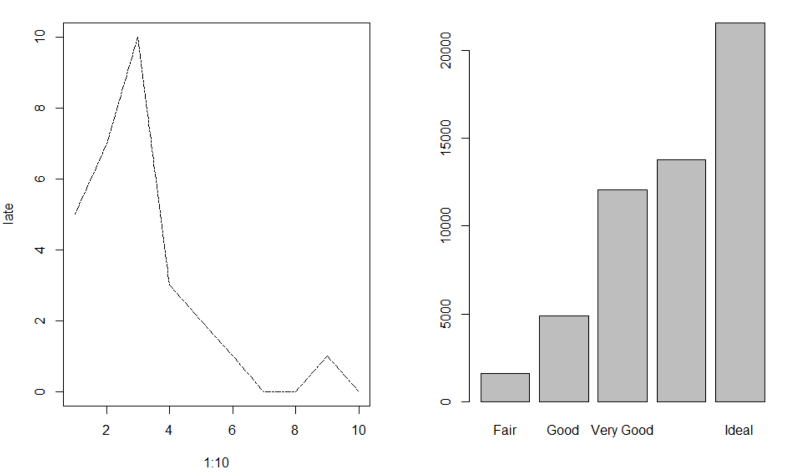
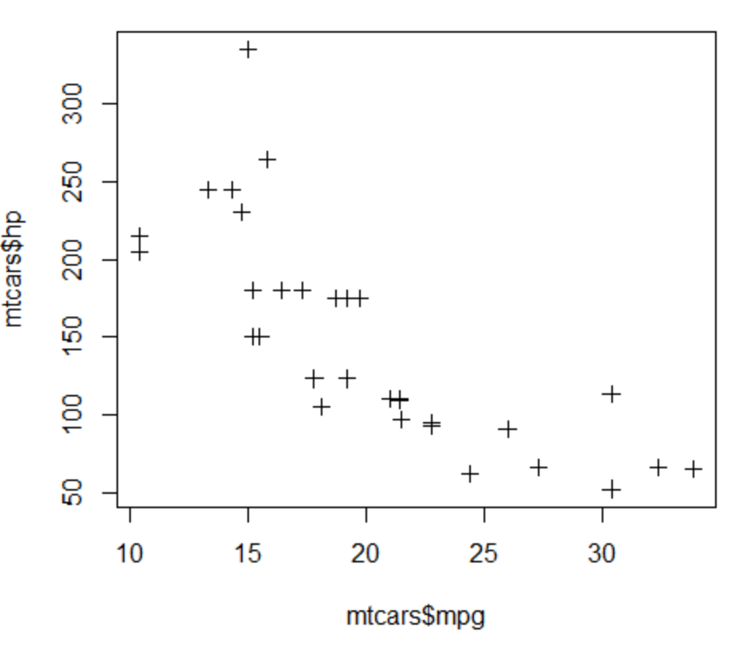
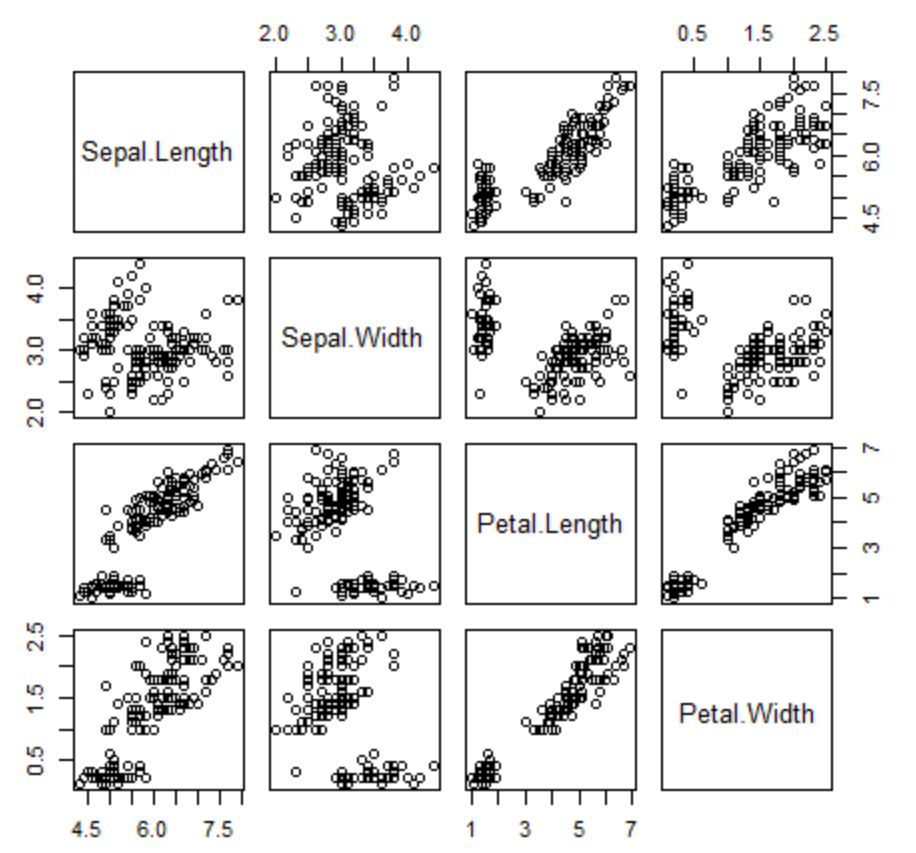
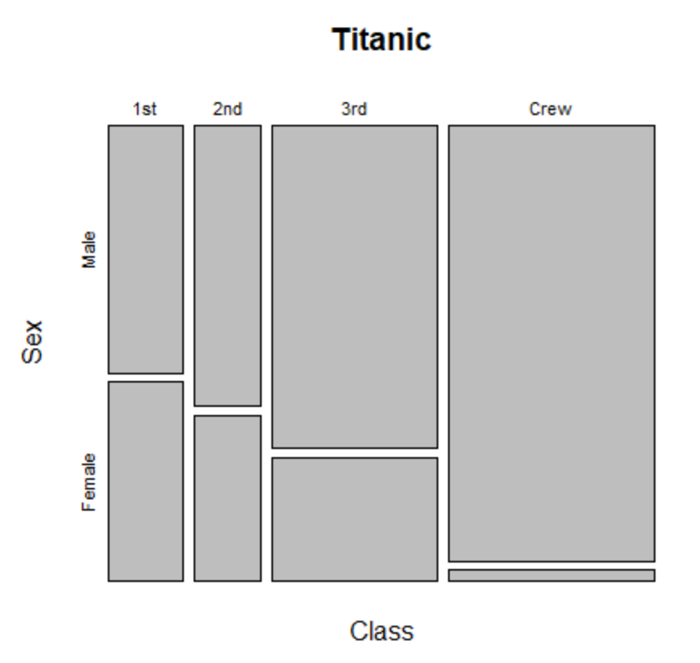

# plot

## 1. line plot (선도표)

> 자료의 값을 점으로 표시하고 그 점들을 선으로 이어서 그린 그래프

- `type ='l'` : 선(line)만 그리기
- `type='o'` : 점과 선을 같이 그리기
- `lty` : 선 종류 (2 : 대쉬선, 3 : 점선)
- `lwd` : 선 굵기

```R
# 같은 함수 다른 느낌
late <- c(5,7,10,3,2,1,0,0,1,0)
plot(1:10, late, type='l',lty=6,lwd=1) 

plot(diamonds$cut)
```



## 2. scatter plot (산점도)

> x축, y축으로 이루어진 그래프에 두 변수의 값을 점으로 나타낸 그래프
>
> 1. plot(x, y)
> 2. plot(formula, data)

- `pch` : 포인트 모양

```R
plot(mtcars$mpg,mtcars$hp, pch=3)
```



### 1) scatter plot matrix : 여러 개의 변수에 대해 동시에 산점도를 그리고 싶은 경우 사용

- pairs()

```R
pairs(iris[,1:4])
```




## 3. mosaic plot

> 2원 3원 교차표의 시각화

```R
mosaicplot(~Class + Sex, data=Titanic)
```



