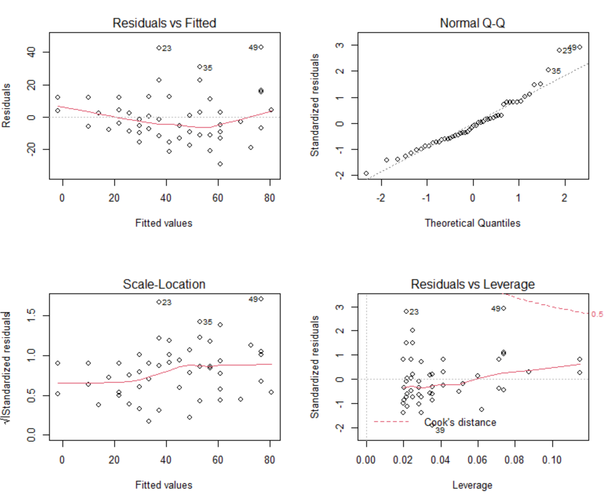
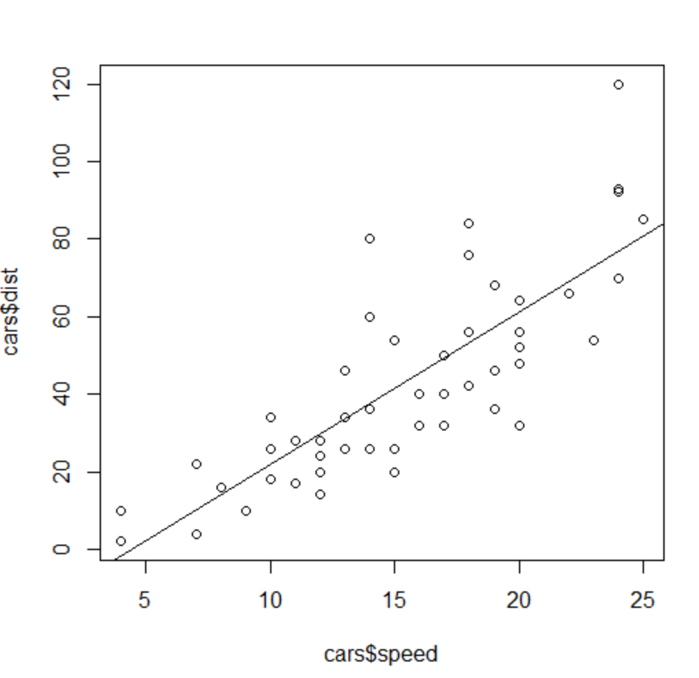
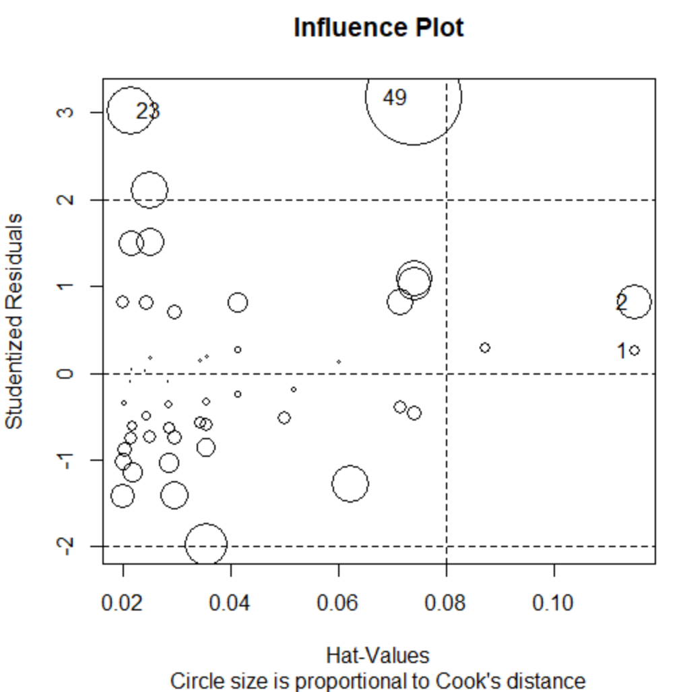

# 단순선형회귀분석

- 모두 연속형 변수

- 종속변수 한 개 = 독립변수 한 개

  

## 독립변수 vs 종속변수

- 독립변수(=설명변수)

  원인이 되는 변수를 의미

- 종속변수(=반응변수)

  결과가 되는 변수를 의미

  - 특정 회사의 매출액과 광고비를 모두 알고 있다면 <u>광고비(독립변수)</u>로 <u>매출액(종속변수)</u>을 예측

  - <u>삶의 만족도(종속변수)</u>에 영향을 주는 요인이 <u>경제적 만족도 ,가족생활 만족도, 인간관계 만족도, 취미생활 만족도(독립변수)</u>라고 할 때 어떤 요인이 가장 큰 영향을 주는지 확인

    

 ## 회귀모형의 가정

1. 정규성 : 종속변수는 독립변수에 영향을 받으며 정규분포를 따른다.
2. 등분산성 : 독립변수에 상관없이 종속변수의 분산은 일정하다.
3. 선형성 : 독립변수와 종속변수는 선형 관계가 있다.(직선적 관계)
4. 독립성 : 종속변수의 값들은 통계적으로 서로 독립되어야 한다.


## 오차항의 가정

1. 오차항은 평균이 0, 분산이 σ²으로 서로 같다.
2. 오차항은 정규분포를 따른다.
3. 오차항은 서로 독립이다.


## 용어 정리

- 회귀계수 : 독립변수에 곱해진 상수로 독립변수의 영향력 정도를 직접적으로 설명하는 숫자

  - 회귀계수(+) : 종속변수에 대한 양(정적)의 영향력

  - 회귀계수(-) : 종속변수에 대한 음(부적)의 영향력

- 설명력(결정계수) : 회귀방적식(모형)이 종속변수를 설명할 수 있는 정보의 수준

- 분산분석표 : 제곱합과 평균제곱, F값과 유의확률(p)을 포함하는 통계표. 분산분석표의 유의확률(p)이 통계적으로 유의하다고 나타나면 회귀방정식(모형)을 사용할 수 있다는 의미

- 가설

  - H0 : 독립변수가 종속변수에 영향을 주지 않는다.
  - H1 : 독립변수가 종속변수에 영향을 준다.


## 분석 준비

### 데이터 구조 확인

```R
str(cars)
summary(cars)
```

```R
'data.frame':	50 obs. of  2 variables:
 $ speed: num  4 4 7 7 8 9 10 10 10 11 ...
 $ dist : num  2 10 4 22 16 10 18 26 34 17 ...

     speed           dist    
 Min.   : 4.0   Min.   :  2  
 1st Qu.:12.0   1st Qu.: 26  
 Median :15.0   Median : 36  
 Mean   :15.4   Mean   : 43  
 3rd Qu.:19.0   3rd Qu.: 56  
 Max.   :25.0   Max.   :120 
```

### psych::describe()를 이용해 기초통계량 산출

```R
library(psych)
describe(cars)
```

```R
      vars  n  mean    sd median trimmed   mad min max range  skew kurtosis   se
speed    1 50 15.40  5.29     15   15.47  5.93   4  25    21 -0.11    -0.67 0.75
dist     2 50 42.98 25.77     36   40.88 23.72   2 120   118  0.76     0.12 3.64
```

### psych::pairs.panels() 이용

```R
# 산점도 행렬을 보여준다
psych::pairs.panels(cars)
```


### plot()을 이용해 데이터의 전체적인 특성 파악

```R
plot(cars)
```


## 분석

### stats::lm()을 이용한 분석

> 회귀계수에 대한 통계적 유의성 확인 가능
>
> 설명력(결정계수), 분산분석 결과에 대한 F값, 유의확률(p)도 알 수 있다.

```R
carFit <- lm(dist~speed, data=cars)
summary(carFit)
```

```R
Call: # 회귀모델
lm(formula = dist ~ speed, data = cars)

Residuals: # 실제 데이터에서 관측된 잔차의 분포
   Min     1Q Median     3Q    Max 
-29.07  -9.53  -2.27   9.21  43.20 

Coefficients: # 설명변수 평가, 계수들의 통계적 유의성
            Estimate Std. Error t value Pr(>|t|)    
(Intercept)  -17.579      6.758   -2.60    0.012 *  	# 절편
speed          3.932      0.416    9.46  1.5e-12 ***	# 기울기
# 절편과 speed에 대한 p 값이 모두 0.05보다 작으므로 귀무가설 기각.
# 계수는 0이 아니며 구한 계수가 통계적으로 유의미
# dist = -17.579 +  3.932 * speed
---
Signif. codes:  0 ‘***’ 0.001 ‘**’ 0.01 ‘*’ 0.05 ‘.’ 0.1 ‘ ’ 1

Residual standard error: 15.4 on 48 degrees of freedom
Multiple R-squared:  0.651,	Adjusted R-squared:  0.644 	# 회귀직선의 설명정도 평가
F-statistic: 89.6 on 1 and 48 DF,  p-value: 1.49e-12	# F통계량을 통한 회귀식의 유의성 평가
# F통계량은 다음 가설에 대한 검정 결과
# H0 : 측정된 값들은 회귀식으로 설명할 수 없다.
# H1 : 측정된 값들은 회귀식으로 설명할 수 있다.
# 따라서, p-value: 1.49e-12으로 p값이 매우 작아 귀무가설을 기각하므로, 추정된 회귀모델은 유의미하다.
```

### 회귀계수 신뢰구간 : confint()

```R
# 회귀계수
coef(carFit) # -17.5791 + 3.9324 * 3
# 적합된 값
fitted(carFit)

# 신뢰구간
confint(carsFit)
```

```R
              2.5 %  97.5 %		# 신뢰하한 / 신뢰상한
(Intercept) -31.168 -3.9903
speed         3.097  4.7679
```

### 개별 예측값 신뢰구간 : predict()

```R
# predict(object, newdata, interval=c("confidence","prediction","none"))
# newdata : 예측을 수행할 데이터
# confidence : 회귀계수의 신뢰구간을 고려한 평균 신뢰구간 계산
# prediction : 오차를 고려한 신뢰구간 계산
predict(carFit, newdata=data.frame(speed=c(4.5, 9)))
```

```R
       1        2 
 0.11674 17.81258 
```

### 잔차

> 실제값과 예측값의 차이를 의미
>
> 모집단에 대해서는 오차라고 하며, 표본집단에 대해서는 잔차라고 함

```R
residuals(carFit)[1:4] # 데이터가 많아서 조금만 보기 위해 [1:4] 추가
      1       2       3       4 
 3.8495 11.8495 -5.9478 12.0522 
```


### 잔차제곱합 : deviance()

- 데이터와 추정된 모델 간의 불일치 정도
- 작을수록 원래 데이터의 추정된 값과 일치

```R
deviance(cars)
```

```R
[1] 11354
```


## 회귀모형 가정에 대한 검정

### 1. 오차항의 정규성 검정

```R
shapiro.test(residuals(carFit))
```

```R
	Shapiro-Wilk normality test

data:  residuals(carFit)
W = 0.945, p-value = 0.022
```

### 2. 등분산성, 정규성, 이상치인 확인

```R
par(mfrow=c(2,2))
plot(carFit) # enter key
plot(carFit, which=1)
plot(carFit, which=2)
plot(carFit, which=3)
plot(carFit, which=4) # 이상치 확인
plot(carFit, which=5) # 이상치의 위치 확인
plot(carFit, which=6)
```



```R
plot(cars$speed, cars$dist)
abline(coef(carFit))
```



- 이상치, 영향치, 지래점 모두 보여주는 plot

  ```R
  influencePlot(fit2, id.method='identify', main='Influence Plot',
                 sub="Circle size is proportional to Cook's distance")
  ```

  