# 그래프 기본함수 정리

- 옵션 없이 x, y 축만 있는 기본 그래프

  - plot() : 산점도(기본)

    ```R
    plot(1::15)
    plot(1:5, c(5,3,2,6,10))
    ```

## 1. plot() 함수의 주요 옵션

> xlab : x축 이름
> ylab : y축 이름
> xlim : x축 값의 범위
> ylim : y축 값의 범위
> main : 그래프 제목
> pch : 점의 종류
> cex : 점의 크기
> col : 색상
> type : 그래프 유형

- 기본 옵션

```R
plot(x, y,
     xlab="x축 이름",
     ylab="y축 이름",
     main="제목")
```

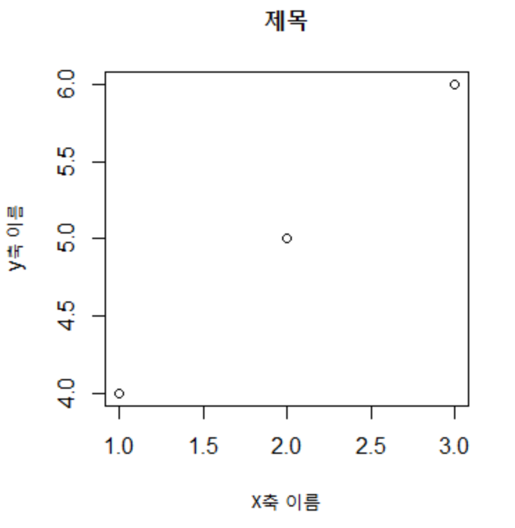

- 점의 크기 및 색상

```R
plot(x, y, cex=3, col='red')
```

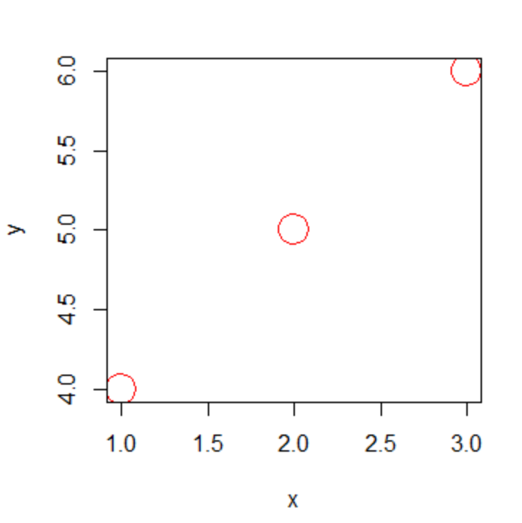

- 축 생략 

```R
# 축 생략
v1 <- c(100, 130, 120, 160, 150)

# x, y축 생략 가능 : axes : FALSE
plot(v1, 
     type = 'o',  # 점과 선을 중첩해서 그림
     col='red',
     ylim=c(0,200),
     axes=FALSE,  # x, y 축 없음
     ann=FALSE)   # 축 제목 없음
```

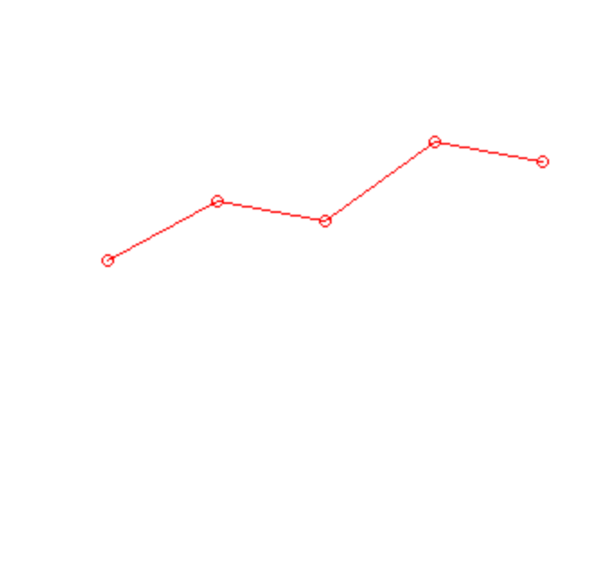

- 축 추가

  axis() 함수

```R
# 1 : x축
# 2 : y축
axis(1, at=c(1:5),
     lab=c('MON','TUE','WEB','THU','FRI'))
axis(2,ylim=c(0,200))

# 그래프 제목 : main 옵션
title(main='FRUIT',
      col.main='red',
      font.main=4)

# 축 제목 : xlab, ylab
title(xlab='DAY', col.lab='red')
title(ylab='PRICE', col.lab='blue')
```

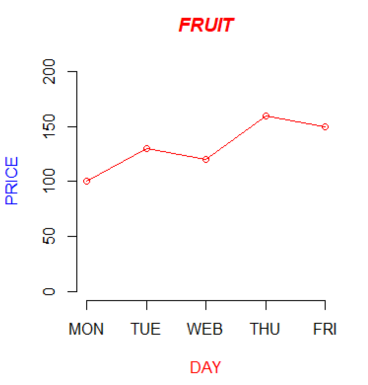

- plot() 선 모양

```R
plot(v1, type='o') # 점과 선을 중첩
plot(v1, type='s') # 왼쪽값을 기초로 계단모양으로 연결
plot(v1, type='l')# 선 모양 : 꺽은선 그래프
```

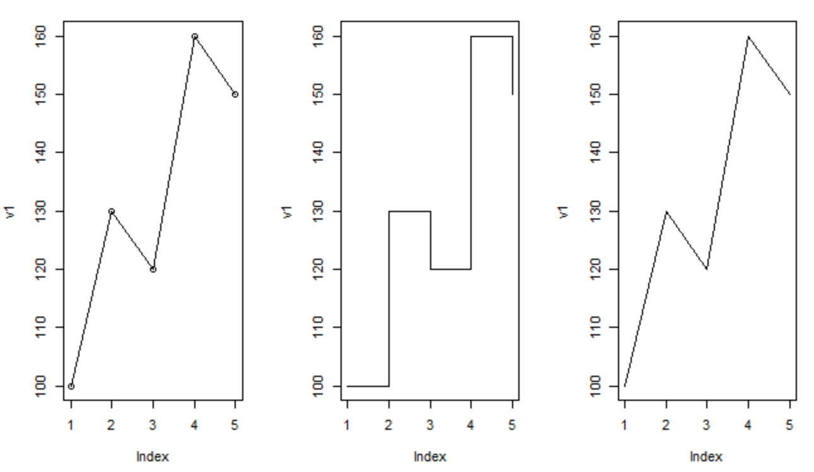


## 2. par() 함수

- 그래픽 파라미터를 지정
- 그래픽 장치의 설정을 정의하는데 이용할 수 있는 함수
- 여러가지 그래픽 인수를 이용해서 화면의 분할방법, 글자크기, 색상 등 여러가지 그래픽 환경을 다양하게 조정

### 1) mfrow : plot 화면 분할

- par(mfrow=c(행, 열))

### 2) mgp : 축 제목, 지표값, 지표선 위치

- par(mgp=c(제목위치, 지표값위치, 지표선위치))

### 3) oma : 그래프 여백

- par(oma=c(아래, 왼쪽, 위, 오른쪽))

### 4) new=[T|F] : 그래프 겹쳐서 그리기

```R
plot(v1, type='s', col='red', ylim=c(1,5))
par(new=T) # 중복 허용
plot(v1, type='o', col='blue', ylim=c(1,5))
par(new=T)
plot(v3, type='l', col='green', ylim=c(1,5))
```

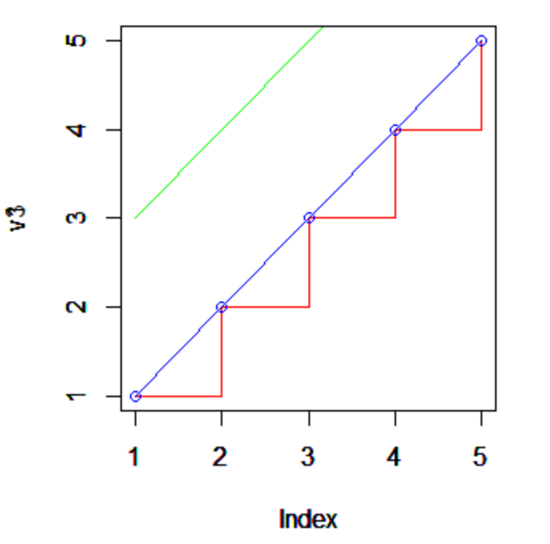

## 3. line() 함수

- plot()으로 출력된 그래프 위에 꺽은 선 추가하는 함수

  ```R
  plot(v1, type='s', col='red', ylim=c(1, 10))
  lines(v2, type='o', col='blue', ylim=c(1,5))
  lines(v3, type='l', col='green', ylim=c(1,15))
  ```

  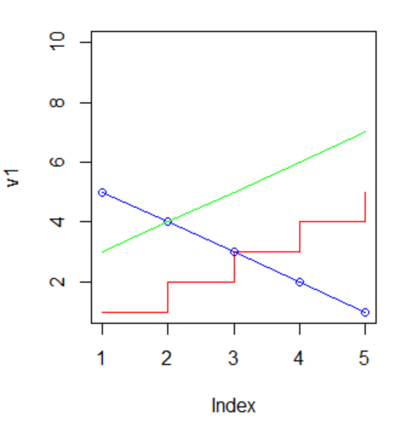

- abline() : 대각선 그리기

  ```R
  # a : 절편
  # 기울기 : 1
  # 검정색, 점선
  # lty=6 : 2개의 대쉬선
  abline(a=0, b=1, col='black', lty=6)
  
  # 수평선 추가 : h= y축값
  # lty=3 : 점선
  abline(h=3, col='red',lty=3)
  
  # 수직선 추가 : v = y축값
  # lty=2 : 대시선
  abline(v=5,col='blue',lty=2)
  ```

  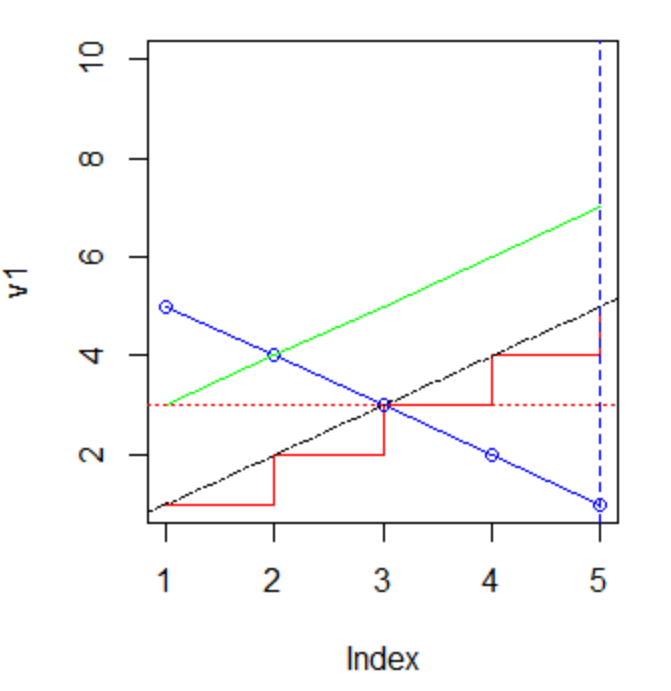

## 4. 범례

```R
## legend 위치 : x,y / left, bottom, center, topleft
legend(4,10,
       c('v1','v2','v3'),
       cex=0.8,
       col=c('red','blue','green'),
       lty=1) # 실선

legend('bottomright',
       c('v1','v2','v3'),
       cex=0.8,
       col=c('red','blue','green'),
       lty=1)

```

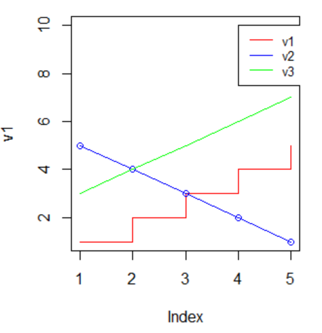

## 5. 화면에 포인트 표시

- arrows() : 화살표 표시

- rect() : 사각형 영역 표시

- text() : 텍스트 표시

- mtext() : 그래프 축 바깥에 텍스트 표시

  ```R
  # arrows() : 화살표 표시
  arrows(2, 30, 2, 20, col='red')
  
  # rect() : 사각형 영역 표시
  rect(2, 30, 3, 20, density=20,col='red')
  
  # text() : 텍스트 표시
  # srt : 각도
  text(3, 35, '키포인트', srt=20)
  
  # mtext() : 그래프 축 바깥에 텍스트 표시
  # side : 1-하, 2-좌, 3-상, 4-우
  mtext('문자열출력', side=3)
  ```

  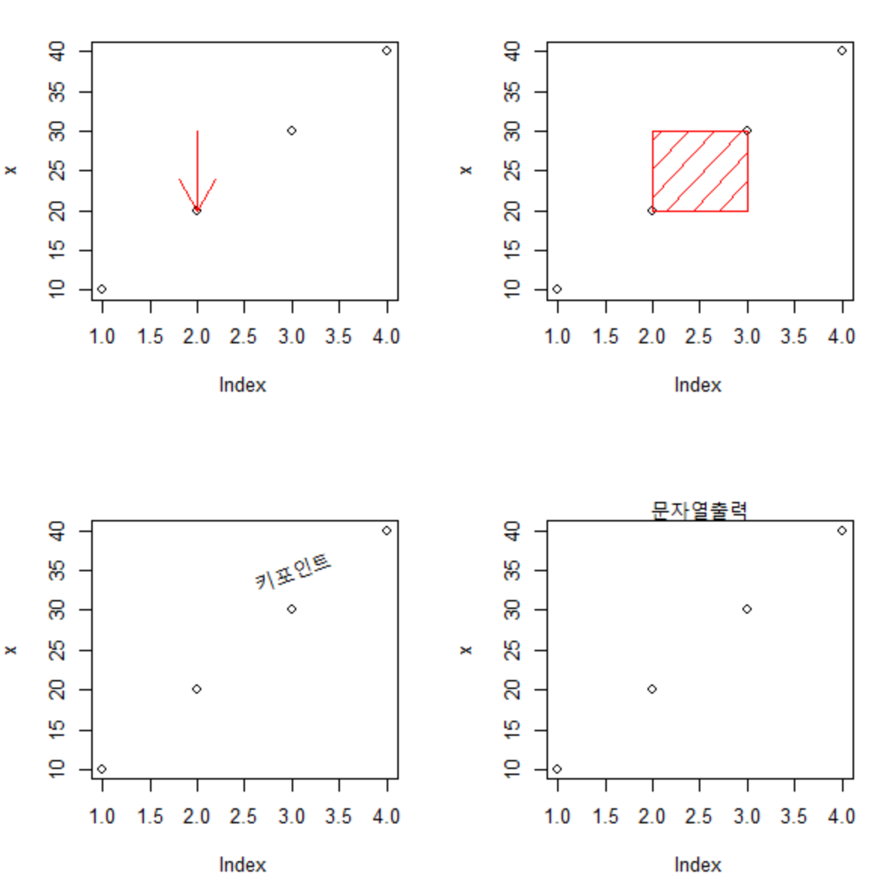


## 6. barplot()

- 범주형 자료의 빈도수를 기둥의 높이로 표현하는 그래프

- barplot(height, 인수, ...)

  - height :

    각 기둥의 높이에 해당하는 값 (벡터 또는 행렬)

    벡터일 경우 각 기둥의 높이가 x 원소들로 결정

    행렬일 경우 열의 개수만큼의 기둥이 만들어지고, 각 기둥의 높이는 행의 값의 누적

  ```R
  # 막대그래프 그리기
  x <- c(1,2,3,4,5)
  barplot(x, names=c(1:5)) # 각각의 막대에 라벨을 만들어 줌
  
  # 그래프 가로로 출력
  barplot(x, horiz=T)
  ```

  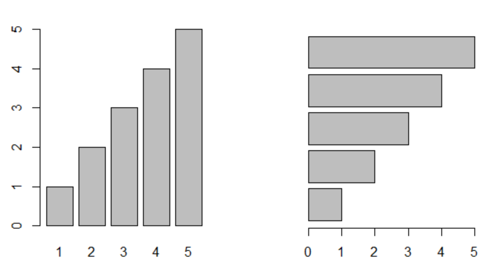

  - beside

  ```R
  # 세로 누적 막대 그래프
  barplot(x,
          names=c(5,3),
          col=c('green','yellow'),
          ylim=c(0,12))
  
  # 세로 묶음 막대 그래프
  barplot(x,
          names=c(5,3),
          beside=T,
          col=c('green','yellow'))
  ```

  
  - 여러 막대 그래프 그룹으로 묶어서 한번에 표현

  ```R
  # 여러 막대 그래프를 그룹으로 묶어서 한꺼번에 출력하기
  v1 <- c(100, 120, 140, 160, 180)
  v2 <- c(120, 130, 150, 140, 170)
  v3 <- c(140, 170, 120, 110, 160)
  
  qty <- data.frame(BANANA=v1, CHERRY=v2, ORANGE=v3)
  
  # height는 반드시 벡터 또는 행렬이어야 함
  # 데이터프레임은 행렬로 변환하고 사용
  barplot(as.matrix(qty),
          main="Fruit' Sales QTY",
          beside=T,
          col=rainbow(nrow(qty)),
          ylim=c(0,300))
  
  legend(14,300,
         c('MON','TUE','WED','THU','FRI'),
         cex=0.8,
         fill=rainbow(nrow(qty)))
  ```

  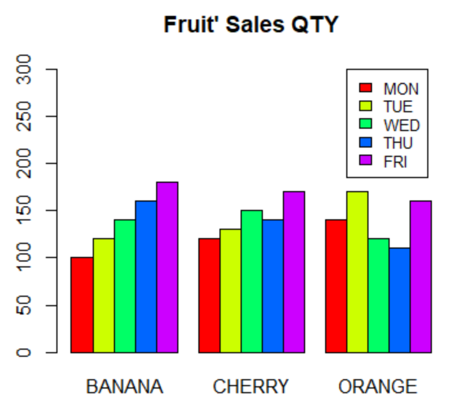
  - 행과 열 변환하여 누적 막대 그래프 그리기

  ```R
  barplot(t(qty),
          main="Fruit's Sales QTY",
          ylim=c(0, 900),
          col=rainbow(length(qty)),
          space=1,   # bar 간격
          cex.axis = 0.8, # y축 값 크기
          las=2, # x축 값 기울기 (1: 가로방향/ 2: 세로방향)
          names.arg = c("MON", "TUE", "WED", "THU", "FRI"),
          cex=0.8) # x축 제목 크기
  
  legend(1, 800,
         names(qty),
         cex = 0.7, 
         fill=rainbow(length(qty)))
  ```

  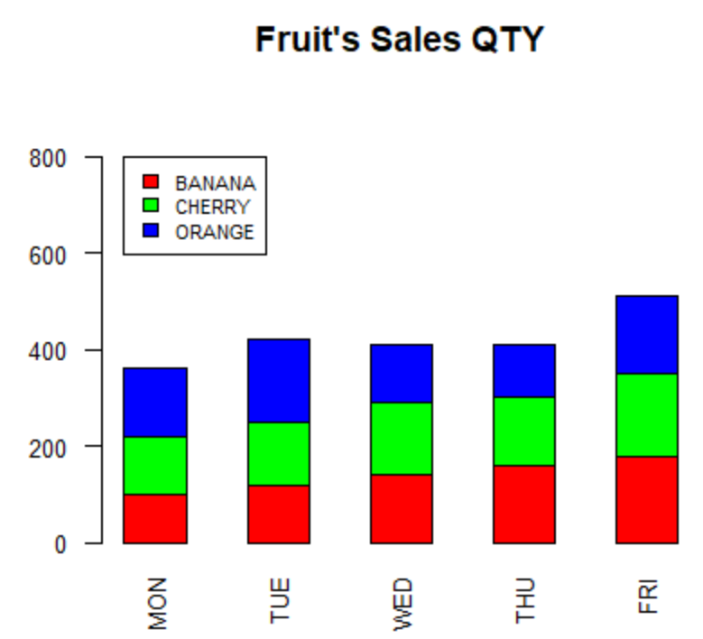

## 7. pie()

- 기본 pie chart 생성

```R
p1 <- c(10,20,30,38)
pie(p1, radius = 1)

# 시작각도 : init.angle = 90
pie(p1, radius = 1, init.angle = 90)
```

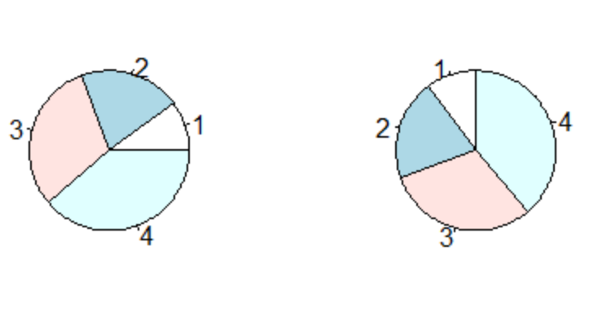

- 색상값, 라벨명, 수치값, 범례

```R
# 색상값과 라벨명 설정
pie(p1,
    radius = 1,  # 원형의 크기
    init.angle = 90,  # 시작 각도
    col=rainbow(length(p1)), # 색상 설정
    label=c("Week 1", "Week2", "Week3" , "Week 4")) # label

# 수치값과 함께 출력하기
# 소수점 1자리 수로 퍼센트 출력
pct <- round(p1/sum(p1)*100,1)
pct
lab <- paste(pct,"%")
lab

pie(p1,
    radius = 1,  # 원형의 크기
    init.angle = 90,  # 시작 각도
    col=rainbow(length(p1)), # 색상 설정
    label=lab) # label

# legend() : 범례
legend('topright',
       c("Week 1", "Week2", "Week3" , "Week 4"),
       cex=0.5,
       fill = rainbow(length(p1)))
```

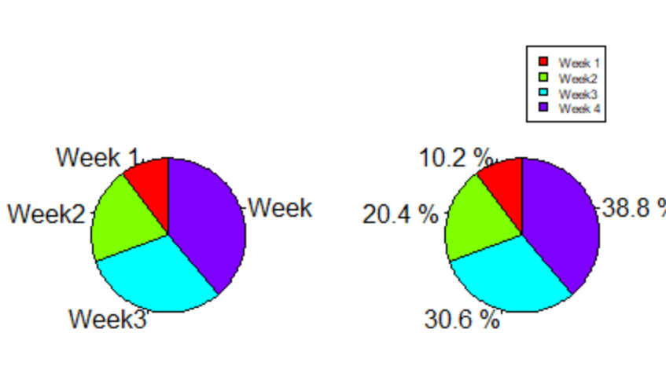

- 범례 생략, 그래프에서 label로 출력

```R
pct <- round(p1/sum(p1)*100,1)
pct
lab1 <-  c("Week 1", "Week2", "Week3" , "Week 4")
lab2 <- paste(lab1,'\n',pct,"%")
lab2

pie(p1,
    radius = 1,  # 원형의 크기
    init.angle = 90,  # 시작 각도
    col=rainbow(length(p1)), # 색상 설정
    label=lab2) # label
```

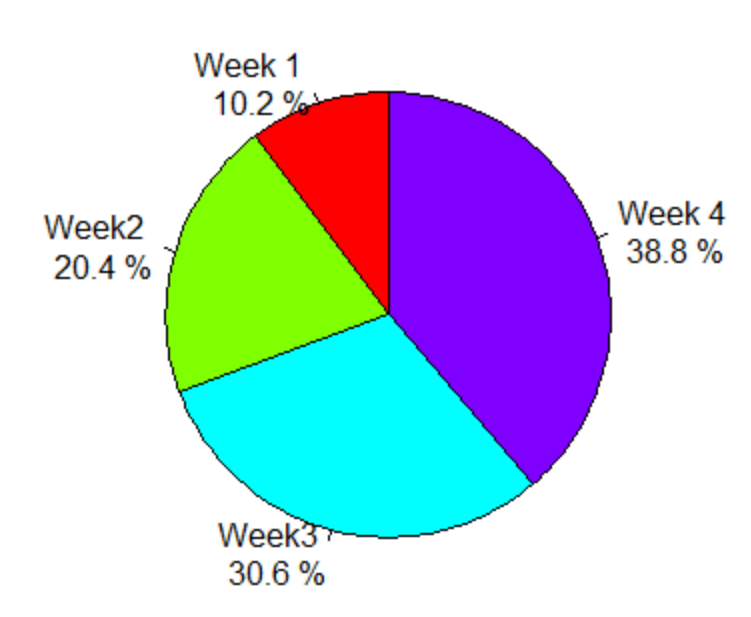