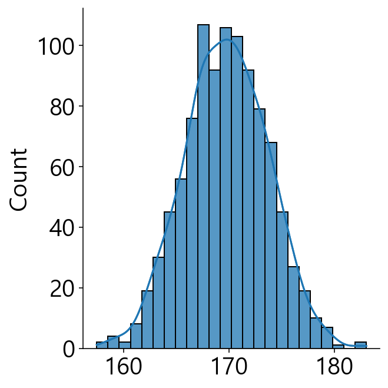
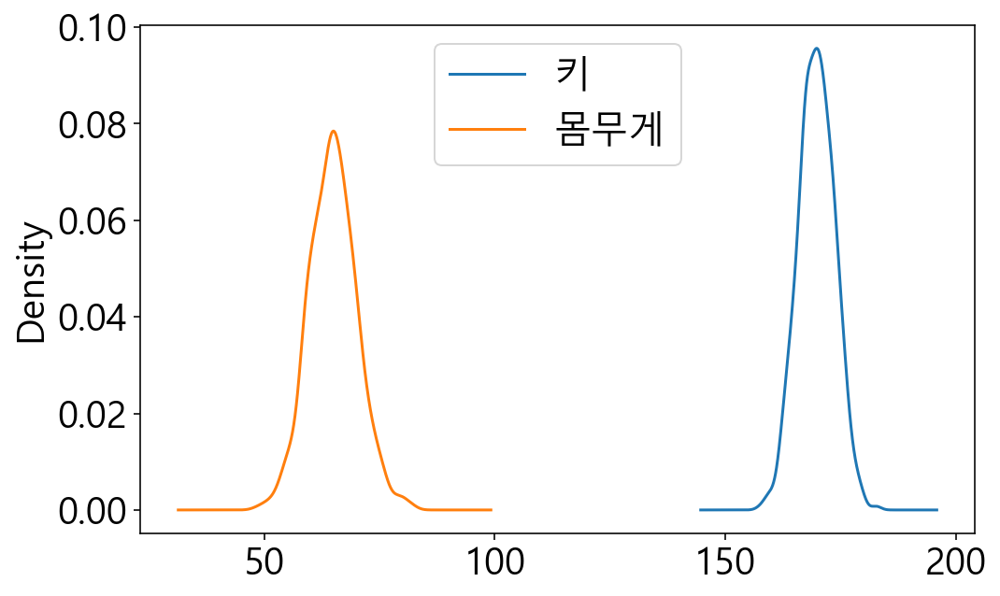
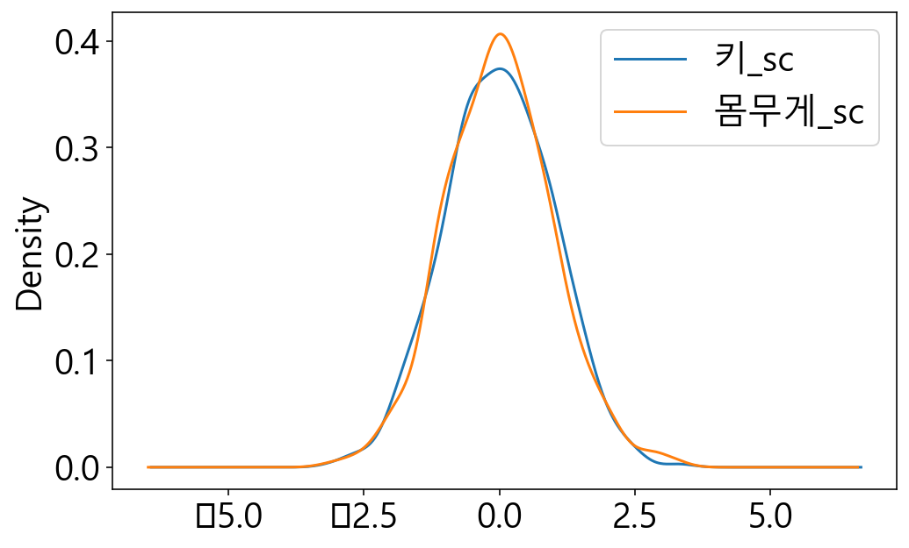
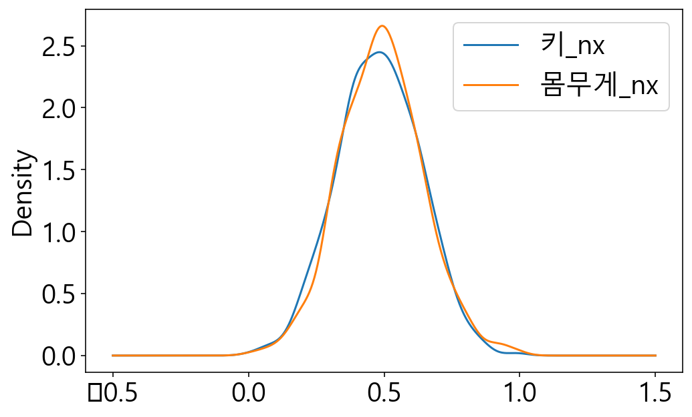
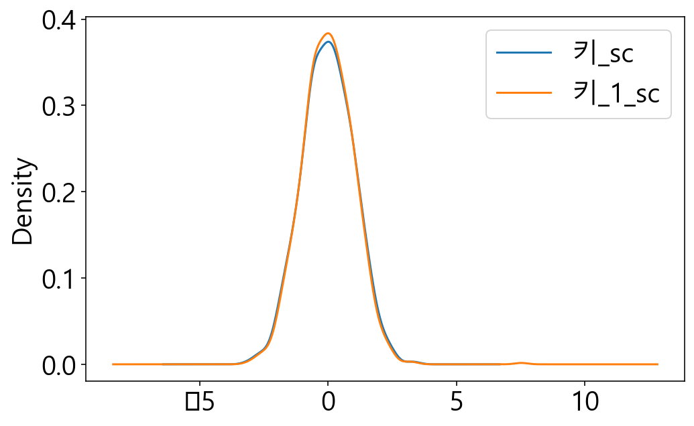
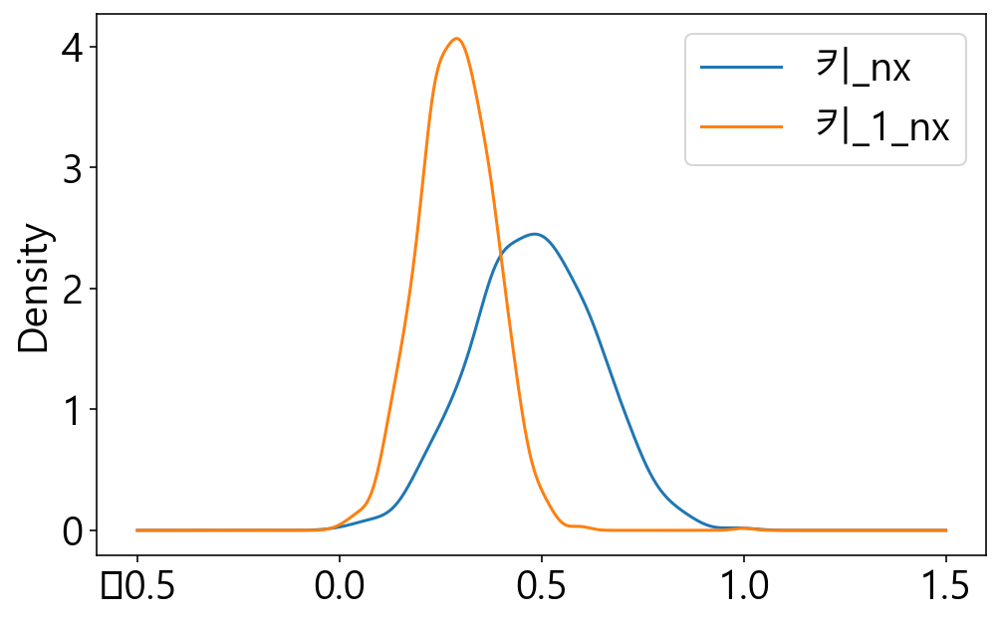
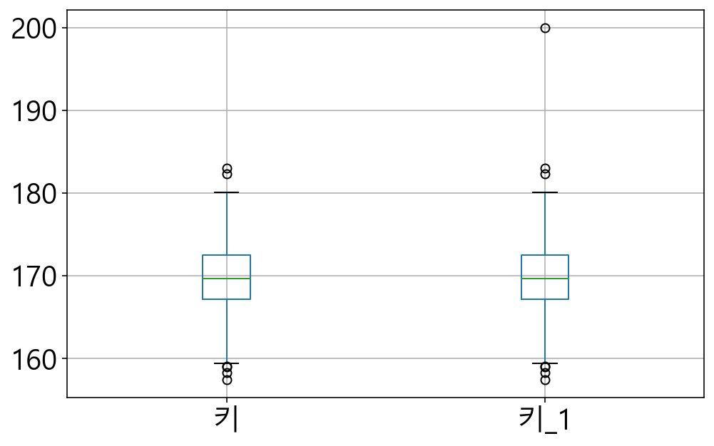
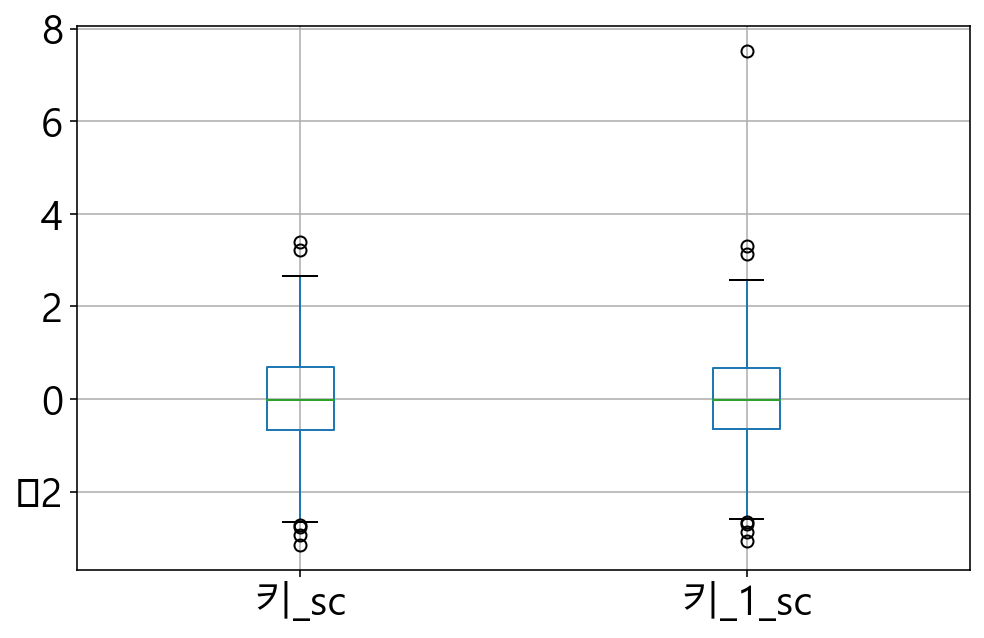
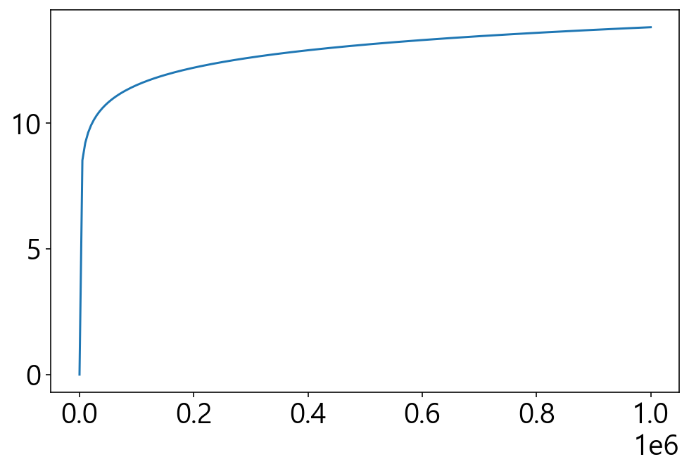
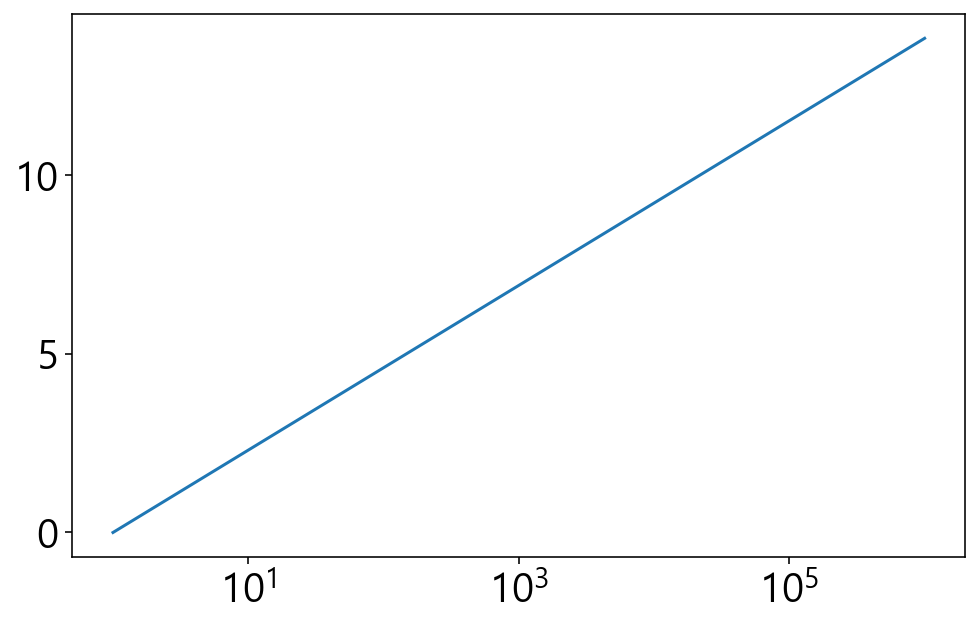

# 데이터 전처리

정의
- 데이터의 분석에 사용할때 성능이 좋아지도록 데이터를 수정하거나 변형하는 작업
- data preprocessing
  
    원시데이터 ⇒ 전처리 ⇒ x ⇒ 데이터분석(머신러닝모델) ⇒ y ⇒ (설명, 군집화, 예측(회귀/분류), 추천)

데이터 전처리 종류(전처리의 필수)
- 데이터 클리닝 - (결측치, 틀린값처리)
- 스케일링 - 여러 변수의 값의 범위를 동등한 조건을 맞추는 것 : 표준스케일링, min-max 스케일링
- 이상치 처리 - 이상치 탐지 및 제거 / 대체
- 데이터변환 - 로그변환, 카테고리인코딩

### 데이터클리닝

결측치 처리
- 값이 비어있는것을 의미(파이썬에서는 빈 값이 Nan으로 표시 : not a number)
- 결측치를 처리하는 세가지 방법
    - 결측치가 포함된 샘플(행)을 버린다
    - 결측치를 적절한 값으로 대체한다(평균이나 0으로 대체하는 것이 일반적)
    - 결측치 처리를 다음 분석 단계로 넘긴다. 즉, 결측치를 그대로 둔다

틀린값 처리
- 잘못된 값
- 틀린값 처리하는 세가지 방법
    - 포함된 샘플(행)을 버린다
    - 적절한 값으로 대체한다(평균이나 0으로 대체하는 것이 일반적)
    - 처리를 다음 분석 단계로 넘긴다. 즉, 틀린값을 그대로 둔다


```python
import numpy as np
import pandas as pd
import matplotlib.pyplot as plt
%matplotlib inline
%config InlineBackend.figure_format = 'retina'
import seaborn as sns # matplotlib를 이용해서 시각화 함수를 제공
```


```python
## 그래프 한글 깨짐 방지
plt.rcParams["font.family"] = 'Malgun Gothic'
plt.rcParams["font.size"] = 20
plt.rcParams["figure.figsize"] = (8, 5)
```

실습데이터 생성
- 키와 몸무게 데이터 생성
- 평균 170, 65, 표준편차 4cm, 5kg


```python
n_sample = 1000
height = 4 * np.random.randn(n_sample).round(2) + 170
weight = 5 * np.random.randn(n_sample).round(2) + 65

## df 생성
df_raw = pd.DataFrame({"키":height, "몸무게":weight})
df_raw.head()
```

<table border="1" class="dataframe">
  <thead>
    <tr style="text-align: right;">
      <th></th>
      <th>키</th>
      <th>몸무게</th>
    </tr>
  </thead>
  <tbody>
    <tr>
      <th>0</th>
      <td>177.32</td>
      <td>66.00</td>
    </tr>
    <tr>
      <th>1</th>
      <td>172.04</td>
      <td>73.65</td>
    </tr>
    <tr>
      <th>2</th>
      <td>167.24</td>
      <td>61.45</td>
    </tr>
    <tr>
      <th>3</th>
      <td>173.80</td>
      <td>58.40</td>
    </tr>
    <tr>
      <th>4</th>
      <td>170.36</td>
      <td>63.65</td>
    </tr>
  </tbody>
</table>


```python
# 원본 백업(copy()이용)
df = df_raw.copy()
```


```python
df["키"].mean()
df["몸무게"].mean()
df["키"].std()
df["몸무게"].std()
```


    5.182353251682597


```python
## 샘플의 확률분포 근사 그래프 보기
sns.displot(df.키.values, kde=True)
sns.histplot(df.키.values, kde=True)
```


    <AxesSubplot:ylabel='Count'>


​    
​    


### 결측치 처리 실습
   - 결측치 확인 np.isnull() 사용
   - 결측치 치환 np.fillna() 사용


```python
df[:5]
```

<table border="1" class="dataframe">
  <thead>
    <tr style="text-align: right;">
      <th></th>
      <th>키</th>
      <th>몸무게</th>
    </tr>
  </thead>
  <tbody>
    <tr>
      <th>0</th>
      <td>177.32</td>
      <td>66.00</td>
    </tr>
    <tr>
      <th>1</th>
      <td>172.04</td>
      <td>73.65</td>
    </tr>
    <tr>
      <th>2</th>
      <td>167.24</td>
      <td>61.45</td>
    </tr>
    <tr>
      <th>3</th>
      <td>173.80</td>
      <td>58.40</td>
    </tr>
    <tr>
      <th>4</th>
      <td>170.36</td>
      <td>63.65</td>
    </tr>
  </tbody>
</table>


```python
# 임의의 값을 na 값으로 변경
df["몸무게"][3] = np.nan
df.head()
```

<table border="1" class="dataframe">
  <thead>
    <tr style="text-align: right;">
      <th></th>
      <th>키</th>
      <th>몸무게</th>
    </tr>
  </thead>
  <tbody>
    <tr>
      <th>0</th>
      <td>177.32</td>
      <td>66.00</td>
    </tr>
    <tr>
      <th>1</th>
      <td>172.04</td>
      <td>73.65</td>
    </tr>
    <tr>
      <th>2</th>
      <td>167.24</td>
      <td>61.45</td>
    </tr>
    <tr>
      <th>3</th>
      <td>173.80</td>
      <td>NaN</td>
    </tr>
    <tr>
      <th>4</th>
      <td>170.36</td>
      <td>63.65</td>
    </tr>
  </tbody>
</table>


```python
#결측치 갯수 세기
df.isnull().sum()
```


    키      0
    몸무게    1
    dtype: int64


```python
# 결측치가 있는 sample 삭제 : dropnp() 함수 사용
# 키는 정상데이터가 있고, 몸무게만 결측
# 결측치가 있는 데이터가 너무 많아서 삭제하면 데이터의 양이 현격하게 줄어들때 - 삭제할 것이니 결정
df2 = df.dropna() # na가 있는 행은 모두 지운다
print(df2.shape)
df2.head()
```

    (999, 2)

<table border="1" class="dataframe">
  <thead>
    <tr style="text-align: right;">
      <th></th>
      <th>키</th>
      <th>몸무게</th>
    </tr>
  </thead>
  <tbody>
    <tr>
      <th>0</th>
      <td>177.32</td>
      <td>66.00</td>
    </tr>
    <tr>
      <th>1</th>
      <td>172.04</td>
      <td>73.65</td>
    </tr>
    <tr>
      <th>2</th>
      <td>167.24</td>
      <td>61.45</td>
    </tr>
    <tr>
      <th>4</th>
      <td>170.36</td>
      <td>63.65</td>
    </tr>
    <tr>
      <th>5</th>
      <td>159.56</td>
      <td>62.50</td>
    </tr>
  </tbody>
</table>


```python
## 결측치를 다른 값을 대체하기
## 0 으로 대체하는 경우
## 몸무게나 키가 0일 수가 없기 때문에 몸무게나 키는 0으로 대체하면 안됨
df.fillna(0).head()
```

<table border="1" class="dataframe">
  <thead>
    <tr style="text-align: right;">
      <th></th>
      <th>키</th>
      <th>몸무게</th>
    </tr>
  </thead>
  <tbody>
    <tr>
      <th>0</th>
      <td>177.32</td>
      <td>66.00</td>
    </tr>
    <tr>
      <th>1</th>
      <td>172.04</td>
      <td>73.65</td>
    </tr>
    <tr>
      <th>2</th>
      <td>167.24</td>
      <td>61.45</td>
    </tr>
    <tr>
      <th>3</th>
      <td>173.80</td>
      <td>0.00</td>
    </tr>
    <tr>
      <th>4</th>
      <td>170.36</td>
      <td>63.65</td>
    </tr>
  </tbody>
</table>


```python
## 결측치를 다른 값으로 대체하기
## 평균으로 대체하기
## 키와 몸무게 데이터는 평균으로 대체하는 경우가 많음
df3 = df.fillna(df["몸무게"].mean())
df3.shape
```


    (1000, 2)


```python
df3.head()
```

<table border="1" class="dataframe">
  <thead>
    <tr style="text-align: right;">
      <th></th>
      <th>키</th>
      <th>몸무게</th>
    </tr>
  </thead>
  <tbody>
    <tr>
      <th>0</th>
      <td>177.32</td>
      <td>66.000000</td>
    </tr>
    <tr>
      <th>1</th>
      <td>172.04</td>
      <td>73.650000</td>
    </tr>
    <tr>
      <th>2</th>
      <td>167.24</td>
      <td>61.450000</td>
    </tr>
    <tr>
      <th>3</th>
      <td>173.80</td>
      <td>64.928128</td>
    </tr>
    <tr>
      <th>4</th>
      <td>170.36</td>
      <td>63.650000</td>
    </tr>
  </tbody>
</table>


```python
## 결측치를 다른 값으로 대체하기
## 결측치 행의 주변값으로 대체하기
## 날씨와 관련된 데이터 등 시계열 데이터인 경우 많이 사용
## fillna(method="ffill/bfill") : forwardfill, backwardfill
df.fillna(method="ffill").head()
```

<table border="1" class="dataframe">
  <thead>
    <tr style="text-align: right;">
      <th></th>
      <th>키</th>
      <th>몸무게</th>
    </tr>
  </thead>
  <tbody>
    <tr>
      <th>0</th>
      <td>177.32</td>
      <td>66.00</td>
    </tr>
    <tr>
      <th>1</th>
      <td>172.04</td>
      <td>73.65</td>
    </tr>
    <tr>
      <th>2</th>
      <td>167.24</td>
      <td>61.45</td>
    </tr>
    <tr>
      <th>3</th>
      <td>173.80</td>
      <td>61.45</td>
    </tr>
    <tr>
      <th>4</th>
      <td>170.36</td>
      <td>63.65</td>
    </tr>
  </tbody>
</table>


### 스케일링
- 여러 변수 값의 범위가 서로 다른경우 데이터 분석에 동일한 비중으로 반영되도록 하기위해 동일한 범위로 변환하는 과정 (ex : 과목 성적 30점 만점 환상)
- 표준스케일링을 가장 많이 사용(평균을 0, 표준편차가 1이 되도록 변환)
  표준 스케일링했다고 분포가 변하지는 않는다. 데이터 분포 형태는 그대로 유지되고 평균이 0, 표준편차 1
- 값의 최소치와 최대치가 정해진 경우 min-max 스케일링도 자주 사용(최소값을 0, 최대값 1로)
    - 전압이 0~5만 나온다면 min-max 스케일링 사용

표준스케일링 : 관측치 - 평균 / 표준편차


```python
## 키와 몸무게 데이터를 각각 표준 스케일링 한 후, 컬럼에 추가
## fit_transform() : 표준 스케일링 구성
df = df_raw.copy() # 결측치 없는 데이터 사용
```


```python
from sklearn.preprocessing import StandardScaler # 표준 스케일링 함수
scale = StandardScaler() # 생성자 호출해서 객체 생성
df[["키_sc", "몸무게_sc"]] = scale.fit_transform(df[["키","몸무게"]])
```


```python
df.head()
```

<table border="1" class="dataframe">
  <thead>
    <tr style="text-align: right;">
      <th></th>
      <th>키</th>
      <th>몸무게</th>
      <th>키_sc</th>
      <th>몸무게_sc</th>
    </tr>
  </thead>
  <tbody>
    <tr>
      <th>0</th>
      <td>177.32</td>
      <td>66.00</td>
      <td>1.934110</td>
      <td>0.208195</td>
    </tr>
    <tr>
      <th>1</th>
      <td>172.04</td>
      <td>73.65</td>
      <td>0.583574</td>
      <td>1.685097</td>
    </tr>
    <tr>
      <th>2</th>
      <td>167.24</td>
      <td>61.45</td>
      <td>-0.644185</td>
      <td>-0.670224</td>
    </tr>
    <tr>
      <th>3</th>
      <td>173.80</td>
      <td>58.40</td>
      <td>1.033753</td>
      <td>-1.259054</td>
    </tr>
    <tr>
      <th>4</th>
      <td>170.36</td>
      <td>63.65</td>
      <td>0.153859</td>
      <td>-0.245494</td>
    </tr>
  </tbody>
</table>


```python
# scale의 평균, 표준편차
scale.mean_ , scale.scale_
```


    (array([169.75848,  64.9216 ]), array([3.90956132, 5.17976143]))


```python
df["몸무게_sc"].mean() # 0.00000000000000010027
df["키_sc"].mean() # 0.00000000000000050372
```


    2.161826273550105e-15


## 스케일링 이전의 원래값으로 환원
- inverse_transform() 사용


```python
## 스케일링 이전 원레값 보기
scale.inverse_transform(df[["키_sc", "몸무게_sc"]])[:5]
```


    array([[177.32,  66.  ],
           [172.04,  73.65],
           [167.24,  61.45],
           [173.8 ,  58.4 ],
           [170.36,  63.65]])


```python
## 데이터 분포 시각화
df[["키", "몸무게"]].plot.kde() # 히스토그램에 가장 근접한 확률분포함수를 이용한 그래프 그림
## 두 데이터 범위가 다르게 나타남
```


    


```python
## 데이터 분포 시각화
df[["키_sc", "몸무게_sc"]].plot.kde() # 히스토그램에 가장 근접한 확률분포함수를 이용한 그래프 그림
```


    


```python
## min_max 스케일링 (데이터의 최소값이 0 최대값이 1이 되도록 조정)
from sklearn.preprocessing import MinMaxScaler
minmax = MinMaxScaler()
df[["키_nx","몸무게_nx"]] = minmax.fit_transform(df[["키","몸무게"]])
df.head()
```

<table border="1" class="dataframe">
  <thead>
    <tr style="text-align: right;">
      <th></th>
      <th>키</th>
      <th>몸무게</th>
      <th>키_sc</th>
      <th>몸무게_sc</th>
      <th>키_nx</th>
      <th>몸무게_nx</th>
      <th>키_1</th>
      <th>키_1_sc</th>
      <th>키_1_nx</th>
    </tr>
  </thead>
  <tbody>
    <tr>
      <th>0</th>
      <td>177.32</td>
      <td>66.00</td>
      <td>1.934110</td>
      <td>0.208195</td>
      <td>0.776562</td>
      <td>0.522124</td>
      <td>200.00</td>
      <td>7.521517</td>
      <td>1.000000</td>
    </tr>
    <tr>
      <th>1</th>
      <td>172.04</td>
      <td>73.65</td>
      <td>0.583574</td>
      <td>1.685097</td>
      <td>0.570312</td>
      <td>0.747788</td>
      <td>172.04</td>
      <td>0.562229</td>
      <td>0.343045</td>
    </tr>
    <tr>
      <th>2</th>
      <td>167.24</td>
      <td>61.45</td>
      <td>-0.644185</td>
      <td>-0.670224</td>
      <td>0.382812</td>
      <td>0.387906</td>
      <td>167.24</td>
      <td>-0.632499</td>
      <td>0.230263</td>
    </tr>
    <tr>
      <th>3</th>
      <td>173.80</td>
      <td>58.40</td>
      <td>1.033753</td>
      <td>-1.259054</td>
      <td>0.639063</td>
      <td>0.297935</td>
      <td>173.80</td>
      <td>1.000296</td>
      <td>0.384398</td>
    </tr>
    <tr>
      <th>4</th>
      <td>170.36</td>
      <td>63.65</td>
      <td>0.153859</td>
      <td>-0.245494</td>
      <td>0.504688</td>
      <td>0.452802</td>
      <td>170.36</td>
      <td>0.144074</td>
      <td>0.303571</td>
    </tr>
  </tbody>
</table>


```python
## min_max 스케일링 분포 확인
df[["키_nx","몸무게_nx"]].plot.kde()
```


    


```python
df["키_nx"].min(), df["키_nx"].max()
```


    (0.0, 1.0)


```python
## 이상치가 포함될 경우
## 이상치가 포함된 키 데이터 생성 키_1
키_1 = height.copy()
키_1[0] = 200
df["키_1"] = 키_1
```


```python
df.head()
```

<table border="1" class="dataframe">
  <thead>
    <tr style="text-align: right;">
      <th></th>
      <th>키</th>
      <th>몸무게</th>
      <th>키_sc</th>
      <th>몸무게_sc</th>
      <th>키_nx</th>
      <th>몸무게_nx</th>
      <th>키_1</th>
      <th>키_1_sc</th>
      <th>키_1_nx</th>
    </tr>
  </thead>
  <tbody>
    <tr>
      <th>0</th>
      <td>177.32</td>
      <td>66.00</td>
      <td>1.934110</td>
      <td>0.208195</td>
      <td>0.776562</td>
      <td>0.522124</td>
      <td>200.00</td>
      <td>7.521517</td>
      <td>1.000000</td>
    </tr>
    <tr>
      <th>1</th>
      <td>172.04</td>
      <td>73.65</td>
      <td>0.583574</td>
      <td>1.685097</td>
      <td>0.570312</td>
      <td>0.747788</td>
      <td>172.04</td>
      <td>0.562229</td>
      <td>0.343045</td>
    </tr>
    <tr>
      <th>2</th>
      <td>167.24</td>
      <td>61.45</td>
      <td>-0.644185</td>
      <td>-0.670224</td>
      <td>0.382812</td>
      <td>0.387906</td>
      <td>167.24</td>
      <td>-0.632499</td>
      <td>0.230263</td>
    </tr>
    <tr>
      <th>3</th>
      <td>173.80</td>
      <td>58.40</td>
      <td>1.033753</td>
      <td>-1.259054</td>
      <td>0.639063</td>
      <td>0.297935</td>
      <td>173.80</td>
      <td>1.000296</td>
      <td>0.384398</td>
    </tr>
    <tr>
      <th>4</th>
      <td>170.36</td>
      <td>63.65</td>
      <td>0.153859</td>
      <td>-0.245494</td>
      <td>0.504688</td>
      <td>0.452802</td>
      <td>170.36</td>
      <td>0.144074</td>
      <td>0.303571</td>
    </tr>
  </tbody>
</table>


```python
## 이상치가 포함된 데이터(컬럼)에 표준 스케일링 적용
df["키_1_sc"] = scale.fit_transform(df[["키_1"]])
df.head()
```

<table border="1" class="dataframe">
  <thead>
    <tr style="text-align: right;">
      <th></th>
      <th>키</th>
      <th>몸무게</th>
      <th>키_sc</th>
      <th>몸무게_sc</th>
      <th>키_nx</th>
      <th>몸무게_nx</th>
      <th>키_1</th>
      <th>키_1_sc</th>
      <th>키_1_nx</th>
    </tr>
  </thead>
  <tbody>
    <tr>
      <th>0</th>
      <td>177.32</td>
      <td>66.00</td>
      <td>1.934110</td>
      <td>0.208195</td>
      <td>0.776562</td>
      <td>0.522124</td>
      <td>200.00</td>
      <td>7.521517</td>
      <td>1.000000</td>
    </tr>
    <tr>
      <th>1</th>
      <td>172.04</td>
      <td>73.65</td>
      <td>0.583574</td>
      <td>1.685097</td>
      <td>0.570312</td>
      <td>0.747788</td>
      <td>172.04</td>
      <td>0.562229</td>
      <td>0.343045</td>
    </tr>
    <tr>
      <th>2</th>
      <td>167.24</td>
      <td>61.45</td>
      <td>-0.644185</td>
      <td>-0.670224</td>
      <td>0.382812</td>
      <td>0.387906</td>
      <td>167.24</td>
      <td>-0.632499</td>
      <td>0.230263</td>
    </tr>
    <tr>
      <th>3</th>
      <td>173.80</td>
      <td>58.40</td>
      <td>1.033753</td>
      <td>-1.259054</td>
      <td>0.639063</td>
      <td>0.297935</td>
      <td>173.80</td>
      <td>1.000296</td>
      <td>0.384398</td>
    </tr>
    <tr>
      <th>4</th>
      <td>170.36</td>
      <td>63.65</td>
      <td>0.153859</td>
      <td>-0.245494</td>
      <td>0.504688</td>
      <td>0.452802</td>
      <td>170.36</td>
      <td>0.144074</td>
      <td>0.303571</td>
    </tr>
  </tbody>
</table>


```python
df[["키_sc", "키_1_sc"]].plot.kde()
```


    


```python
df["키_1_nx"] = minmax.fit_transform(df[["키_1"]])
df.head()
```

<table border="1" class="dataframe">
  <thead>
    <tr style="text-align: right;">
      <th></th>
      <th>키</th>
      <th>몸무게</th>
      <th>키_sc</th>
      <th>몸무게_sc</th>
      <th>키_nx</th>
      <th>몸무게_nx</th>
      <th>키_1</th>
      <th>키_1_sc</th>
      <th>키_1_nx</th>
    </tr>
  </thead>
  <tbody>
    <tr>
      <th>0</th>
      <td>177.32</td>
      <td>66.00</td>
      <td>1.934110</td>
      <td>0.208195</td>
      <td>0.776562</td>
      <td>0.522124</td>
      <td>200.00</td>
      <td>7.521517</td>
      <td>1.000000</td>
    </tr>
    <tr>
      <th>1</th>
      <td>172.04</td>
      <td>73.65</td>
      <td>0.583574</td>
      <td>1.685097</td>
      <td>0.570312</td>
      <td>0.747788</td>
      <td>172.04</td>
      <td>0.562229</td>
      <td>0.343045</td>
    </tr>
    <tr>
      <th>2</th>
      <td>167.24</td>
      <td>61.45</td>
      <td>-0.644185</td>
      <td>-0.670224</td>
      <td>0.382812</td>
      <td>0.387906</td>
      <td>167.24</td>
      <td>-0.632499</td>
      <td>0.230263</td>
    </tr>
    <tr>
      <th>3</th>
      <td>173.80</td>
      <td>58.40</td>
      <td>1.033753</td>
      <td>-1.259054</td>
      <td>0.639063</td>
      <td>0.297935</td>
      <td>173.80</td>
      <td>1.000296</td>
      <td>0.384398</td>
    </tr>
    <tr>
      <th>4</th>
      <td>170.36</td>
      <td>63.65</td>
      <td>0.153859</td>
      <td>-0.245494</td>
      <td>0.504688</td>
      <td>0.452802</td>
      <td>170.36</td>
      <td>0.144074</td>
      <td>0.303571</td>
    </tr>
  </tbody>
</table>


```python
df[["키_nx", "키_1_nx"]].plot.kde()

## 이상치 하나 때문에 데이터의 다른값들이 크게 달라지게 됨
## 정상치 데이터와 이상치 포함 데이터 분포 결과가 달라진다는 건 입력되는 데이터가 달라지게 됨
## minmax 스케일링은 범위가 명확하다라는 전제가 있어야 한다.
```


    


### 이상치 처리

- 경험이 많이 필요한 전처리
- 이상치 처리 목적
    - 이상치를 제거해서 데이터 분석의 정확도를 높이려는 경우
    - 이상치를 찾는 것이 목적
        - 기기 이상을 찾는 경우
        - 신용카드 사용시 특이한 구매를 찾는 경우

#### 이상치 탐지
- boxplot() 을 보면 이상치 존재 파악이 쉽다
- 표준스케일링 한 후 값이 큰 것들(6이상)을 이상치로 봄


```python
## 이상치가 없는 경우와 있는 경의 박스 플롯
df[["키","키_1"]].boxplot()
```




```python
# 스케일링 된 데이터를 비교
df[["키_sc", "키_1_sc"]].boxplot()
```




## 데이터 변환

### 로그 변환


```python
x = np.linspace(1,1000000, 200)
y = np.log(x)
plt.plot(x,y)
```



```python
# x 축을 log 스케일로 그리면(로그를 취하면)
plt.xscale("log")
plt.plot(x,y)
```


    


## log_normal분포
   - 어떤 값에 로그를 취하면 정규분포를 갖는 특성의 데이터

## 카테고리 인코딩
    - 연속형 숫자 데이터를 카테고리형(범주형)으로 바꾸는 것
    - 실력이 늘어나면 용돈을 더 준다


```python
## 키 데이터를 이용해서 등급을 나누기
## 표준편차를 기준으로
## small < 평균을 기준으로 + - 표준편차 중심구간-standard 로 처리 < large 

## tall 변수
```


```python
df
```

<table border="1" class="dataframe">
  <thead>
    <tr style="text-align: right;">
      <th></th>
      <th>키</th>
      <th>몸무게</th>
      <th>키_sc</th>
      <th>몸무게_sc</th>
      <th>키_nx</th>
      <th>몸무게_nx</th>
      <th>키_1</th>
      <th>키_1_sc</th>
      <th>키_1_nx</th>
    </tr>
  </thead>
  <tbody>
    <tr>
      <th>0</th>
      <td>177.32</td>
      <td>66.00</td>
      <td>1.934110</td>
      <td>0.208195</td>
      <td>0.776562</td>
      <td>0.522124</td>
      <td>200.00</td>
      <td>7.521517</td>
      <td>1.000000</td>
    </tr>
    <tr>
      <th>1</th>
      <td>172.04</td>
      <td>73.65</td>
      <td>0.583574</td>
      <td>1.685097</td>
      <td>0.570312</td>
      <td>0.747788</td>
      <td>172.04</td>
      <td>0.562229</td>
      <td>0.343045</td>
    </tr>
    <tr>
      <th>2</th>
      <td>167.24</td>
      <td>61.45</td>
      <td>-0.644185</td>
      <td>-0.670224</td>
      <td>0.382812</td>
      <td>0.387906</td>
      <td>167.24</td>
      <td>-0.632499</td>
      <td>0.230263</td>
    </tr>
    <tr>
      <th>3</th>
      <td>173.80</td>
      <td>58.40</td>
      <td>1.033753</td>
      <td>-1.259054</td>
      <td>0.639063</td>
      <td>0.297935</td>
      <td>173.80</td>
      <td>1.000296</td>
      <td>0.384398</td>
    </tr>
    <tr>
      <th>4</th>
      <td>170.36</td>
      <td>63.65</td>
      <td>0.153859</td>
      <td>-0.245494</td>
      <td>0.504688</td>
      <td>0.452802</td>
      <td>170.36</td>
      <td>0.144074</td>
      <td>0.303571</td>
    </tr>
    <tr>
      <th>...</th>
      <td>...</td>
      <td>...</td>
      <td>...</td>
      <td>...</td>
      <td>...</td>
      <td>...</td>
      <td>...</td>
      <td>...</td>
      <td>...</td>
    </tr>
    <tr>
      <th>995</th>
      <td>174.48</td>
      <td>65.50</td>
      <td>1.207685</td>
      <td>0.111665</td>
      <td>0.665625</td>
      <td>0.507375</td>
      <td>174.48</td>
      <td>1.169549</td>
      <td>0.400376</td>
    </tr>
    <tr>
      <th>996</th>
      <td>164.32</td>
      <td>67.20</td>
      <td>-1.391072</td>
      <td>0.439866</td>
      <td>0.268750</td>
      <td>0.557522</td>
      <td>164.32</td>
      <td>-1.359291</td>
      <td>0.161654</td>
    </tr>
    <tr>
      <th>997</th>
      <td>169.40</td>
      <td>65.25</td>
      <td>-0.091693</td>
      <td>0.063401</td>
      <td>0.467188</td>
      <td>0.500000</td>
      <td>169.40</td>
      <td>-0.094871</td>
      <td>0.281015</td>
    </tr>
    <tr>
      <th>998</th>
      <td>170.64</td>
      <td>64.55</td>
      <td>0.225478</td>
      <td>-0.071741</td>
      <td>0.515625</td>
      <td>0.479351</td>
      <td>170.64</td>
      <td>0.213767</td>
      <td>0.310150</td>
    </tr>
    <tr>
      <th>999</th>
      <td>161.68</td>
      <td>60.95</td>
      <td>-2.066339</td>
      <td>-0.766753</td>
      <td>0.165625</td>
      <td>0.373156</td>
      <td>161.68</td>
      <td>-2.016392</td>
      <td>0.099624</td>
    </tr>
  </tbody>
</table>
<p>1000 rows × 9 columns</p>


```python
m_1 = df["키"].mean() + df["키"].std()
m_2 =  df["키"].mean() - df["키"].std()
tmp = []
for key in df["키"] :
    if key > m_1 :
        tmp.append("large")
    elif key < m_2 :
        tmp.append("small")
    else :
        tmp.append("standard")
df["tall"] = tmp
```


```python
df.head()
```

<table border="1" class="dataframe">
  <thead>
    <tr style="text-align: right;">
      <th></th>
      <th>키</th>
      <th>몸무게</th>
      <th>키_sc</th>
      <th>몸무게_sc</th>
      <th>키_nx</th>
      <th>몸무게_nx</th>
      <th>키_1</th>
      <th>키_1_sc</th>
      <th>키_1_nx</th>
      <th>tall</th>
    </tr>
  </thead>
  <tbody>
    <tr>
      <th>0</th>
      <td>177.32</td>
      <td>66.00</td>
      <td>1.934110</td>
      <td>0.208195</td>
      <td>0.776562</td>
      <td>0.522124</td>
      <td>200.00</td>
      <td>7.521517</td>
      <td>1.000000</td>
      <td>large</td>
    </tr>
    <tr>
      <th>1</th>
      <td>172.04</td>
      <td>73.65</td>
      <td>0.583574</td>
      <td>1.685097</td>
      <td>0.570312</td>
      <td>0.747788</td>
      <td>172.04</td>
      <td>0.562229</td>
      <td>0.343045</td>
      <td>standard</td>
    </tr>
    <tr>
      <th>2</th>
      <td>167.24</td>
      <td>61.45</td>
      <td>-0.644185</td>
      <td>-0.670224</td>
      <td>0.382812</td>
      <td>0.387906</td>
      <td>167.24</td>
      <td>-0.632499</td>
      <td>0.230263</td>
      <td>standard</td>
    </tr>
    <tr>
      <th>3</th>
      <td>173.80</td>
      <td>58.40</td>
      <td>1.033753</td>
      <td>-1.259054</td>
      <td>0.639063</td>
      <td>0.297935</td>
      <td>173.80</td>
      <td>1.000296</td>
      <td>0.384398</td>
      <td>large</td>
    </tr>
    <tr>
      <th>4</th>
      <td>170.36</td>
      <td>63.65</td>
      <td>0.153859</td>
      <td>-0.245494</td>
      <td>0.504688</td>
      <td>0.452802</td>
      <td>170.36</td>
      <td>0.144074</td>
      <td>0.303571</td>
      <td>standard</td>
    </tr>
  </tbody>
</table>


```python
## tall 변수 구성비 확인
df["tall"].value_counts()
```


    standard    677
    small       162
    large       161
    Name: tall, dtype: int64


```python
## tall 변수 구성비율 확인
df["tall"].value_counts() * 100 / len(df)
```


    standard    67.7
    small       16.2
    large       16.1
    Name: tall, dtype: float64


## 원 핫 인코딩
- 카테고리 변수의 일반적인 표현 방법
    - 데이터분석에서는 모든 데이터는 숫자로 바꿔서 표현해야 함
- pd.get_dummies() 사용


```python
## tall 변수의 원핫인코딩
## 오리지널 값이 아니고 더미변수 만들어서 자기가 갖고 있는 값에만 1이 되게 정리
df_tall = pd.get_dummies(df["tall"])
df_tall.head()
```

<table border="1" class="dataframe">
  <thead>
    <tr style="text-align: right;">
      <th></th>
      <th>large</th>
      <th>small</th>
      <th>standard</th>
    </tr>
  </thead>
  <tbody>
    <tr>
      <th>0</th>
      <td>1</td>
      <td>0</td>
      <td>0</td>
    </tr>
    <tr>
      <th>1</th>
      <td>0</td>
      <td>0</td>
      <td>1</td>
    </tr>
    <tr>
      <th>2</th>
      <td>0</td>
      <td>0</td>
      <td>1</td>
    </tr>
    <tr>
      <th>3</th>
      <td>1</td>
      <td>0</td>
      <td>0</td>
    </tr>
    <tr>
      <th>4</th>
      <td>0</td>
      <td>0</td>
      <td>1</td>
    </tr>
  </tbody>
</table>


```python
## 데이터 프레임에 합치기(가로방향)
df_all = pd.concat((df, df_tall), axis=1)
df_all.head()
```

<table border="1" class="dataframe">
  <thead>
    <tr style="text-align: right;">
      <th></th>
      <th>키</th>
      <th>몸무게</th>
      <th>키_sc</th>
      <th>몸무게_sc</th>
      <th>키_nx</th>
      <th>몸무게_nx</th>
      <th>키_1</th>
      <th>키_1_sc</th>
      <th>키_1_nx</th>
      <th>tall</th>
      <th>large</th>
      <th>small</th>
      <th>standard</th>
    </tr>
  </thead>
  <tbody>
    <tr>
      <th>0</th>
      <td>177.32</td>
      <td>66.00</td>
      <td>1.934110</td>
      <td>0.208195</td>
      <td>0.776562</td>
      <td>0.522124</td>
      <td>200.00</td>
      <td>7.521517</td>
      <td>1.000000</td>
      <td>large</td>
      <td>1</td>
      <td>0</td>
      <td>0</td>
    </tr>
    <tr>
      <th>1</th>
      <td>172.04</td>
      <td>73.65</td>
      <td>0.583574</td>
      <td>1.685097</td>
      <td>0.570312</td>
      <td>0.747788</td>
      <td>172.04</td>
      <td>0.562229</td>
      <td>0.343045</td>
      <td>standard</td>
      <td>0</td>
      <td>0</td>
      <td>1</td>
    </tr>
    <tr>
      <th>2</th>
      <td>167.24</td>
      <td>61.45</td>
      <td>-0.644185</td>
      <td>-0.670224</td>
      <td>0.382812</td>
      <td>0.387906</td>
      <td>167.24</td>
      <td>-0.632499</td>
      <td>0.230263</td>
      <td>standard</td>
      <td>0</td>
      <td>0</td>
      <td>1</td>
    </tr>
    <tr>
      <th>3</th>
      <td>173.80</td>
      <td>58.40</td>
      <td>1.033753</td>
      <td>-1.259054</td>
      <td>0.639063</td>
      <td>0.297935</td>
      <td>173.80</td>
      <td>1.000296</td>
      <td>0.384398</td>
      <td>large</td>
      <td>1</td>
      <td>0</td>
      <td>0</td>
    </tr>
    <tr>
      <th>4</th>
      <td>170.36</td>
      <td>63.65</td>
      <td>0.153859</td>
      <td>-0.245494</td>
      <td>0.504688</td>
      <td>0.452802</td>
      <td>170.36</td>
      <td>0.144074</td>
      <td>0.303571</td>
      <td>standard</td>
      <td>0</td>
      <td>0</td>
      <td>1</td>
    </tr>
  </tbody>
</table>


### 최종 사용 데이터
- 여러가지 전처된 데이터 중에서 필요한 부분만 선택하여 최종 데이터 분석에 사용
- 일부 컬럼 선택


```python
# 모든 컬러명 보기
df_all.columns
```


    Index(['키', '몸무게', '키_sc', '몸무게_sc', '키_nx', '몸무게_nx', '키_1', '키_1_sc',
           '키_1_nx', 'tall', 'large', 'small', 'standard'],
          dtype='object')


```python
X = df_all[["키_sc","몸무게_sc", "large", "small", "standard"]]
X
```

<table border="1" class="dataframe">
  <thead>
    <tr style="text-align: right;">
      <th></th>
      <th>키_sc</th>
      <th>몸무게_sc</th>
      <th>large</th>
      <th>small</th>
      <th>standard</th>
    </tr>
  </thead>
  <tbody>
    <tr>
      <th>0</th>
      <td>1.934110</td>
      <td>0.208195</td>
      <td>1</td>
      <td>0</td>
      <td>0</td>
    </tr>
    <tr>
      <th>1</th>
      <td>0.583574</td>
      <td>1.685097</td>
      <td>0</td>
      <td>0</td>
      <td>1</td>
    </tr>
    <tr>
      <th>2</th>
      <td>-0.644185</td>
      <td>-0.670224</td>
      <td>0</td>
      <td>0</td>
      <td>1</td>
    </tr>
    <tr>
      <th>3</th>
      <td>1.033753</td>
      <td>-1.259054</td>
      <td>1</td>
      <td>0</td>
      <td>0</td>
    </tr>
    <tr>
      <th>4</th>
      <td>0.153859</td>
      <td>-0.245494</td>
      <td>0</td>
      <td>0</td>
      <td>1</td>
    </tr>
    <tr>
      <th>...</th>
      <td>...</td>
      <td>...</td>
      <td>...</td>
      <td>...</td>
      <td>...</td>
    </tr>
    <tr>
      <th>995</th>
      <td>1.207685</td>
      <td>0.111665</td>
      <td>1</td>
      <td>0</td>
      <td>0</td>
    </tr>
    <tr>
      <th>996</th>
      <td>-1.391072</td>
      <td>0.439866</td>
      <td>0</td>
      <td>1</td>
      <td>0</td>
    </tr>
    <tr>
      <th>997</th>
      <td>-0.091693</td>
      <td>0.063401</td>
      <td>0</td>
      <td>0</td>
      <td>1</td>
    </tr>
    <tr>
      <th>998</th>
      <td>0.225478</td>
      <td>-0.071741</td>
      <td>0</td>
      <td>0</td>
      <td>1</td>
    </tr>
    <tr>
      <th>999</th>
      <td>-2.066339</td>
      <td>-0.766753</td>
      <td>0</td>
      <td>1</td>
      <td>0</td>
    </tr>
  </tbody>
</table>
<p>1000 rows × 5 columns</p>
