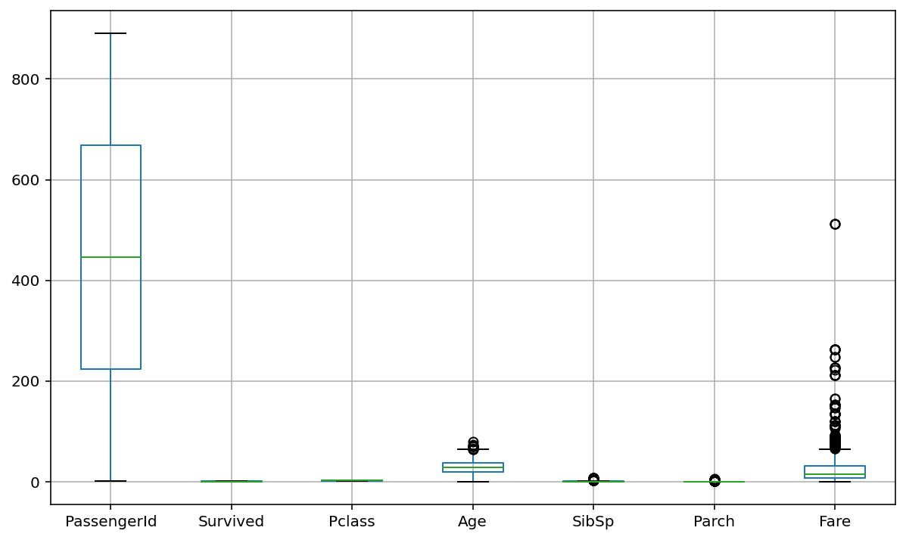
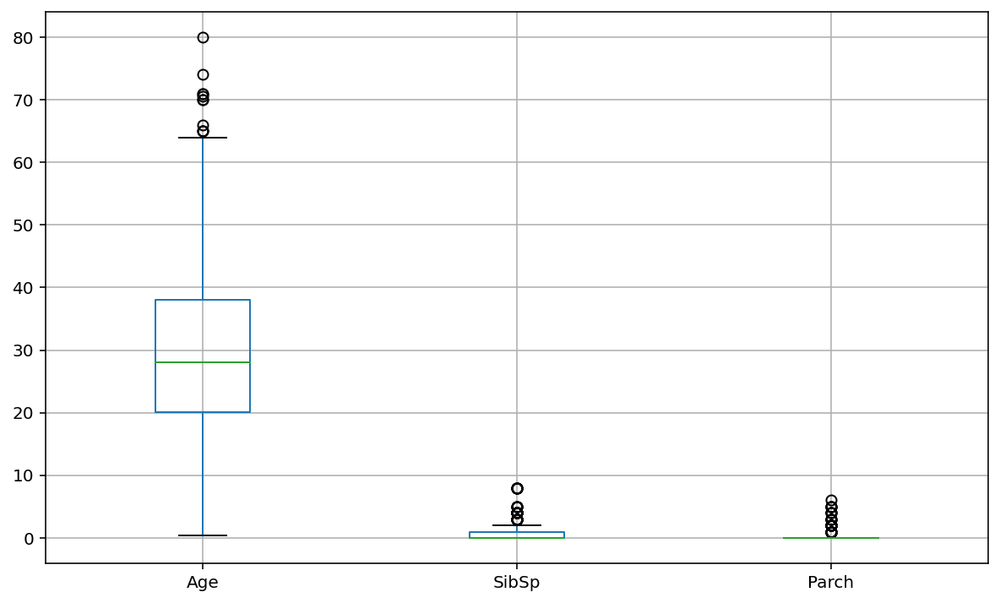
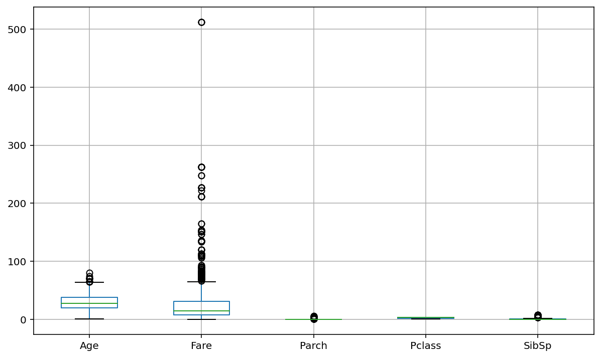
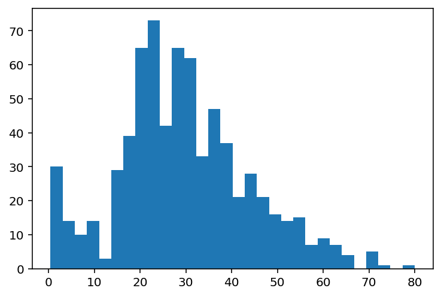
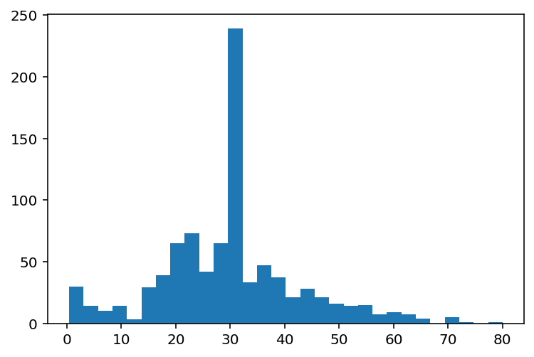
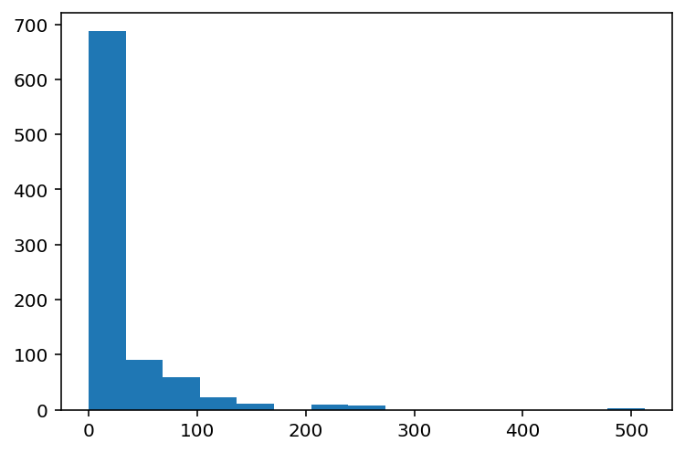
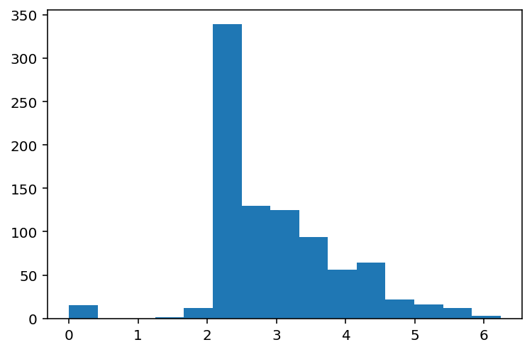
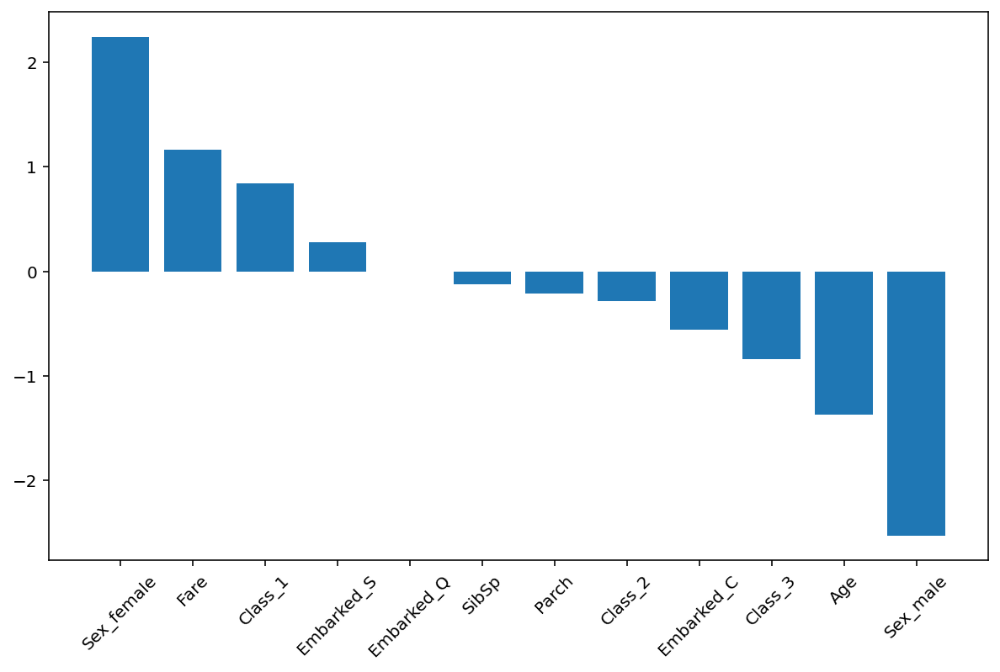

# 타이타닉 생존자 예측 문제 데이터의 전처리 실습


```python
import numpy as np
import pandas as pd
import matplotlib.pyplot as plt
%matplotlib inline
%config InlineBackend.figure_format = 'retina'
import seaborn as sns # matplotlib를 이용해서 시각화 함수를 제공
```


```python
## 데이터 읽어오기
data = pd.read_csv("../data/titanic.csv")
print(data.shape)
data.head()
```

<table border="1" class="dataframe">
  <thead>
    <tr style="text-align: right;">
      <th></th>
      <th>PassengerId</th>
      <th>Survived</th>
      <th>Pclass</th>
      <th>Name</th>
      <th>Sex</th>
      <th>Age</th>
      <th>SibSp</th>
      <th>Parch</th>
      <th>Ticket</th>
      <th>Fare</th>
      <th>Cabin</th>
      <th>Embarked</th>
    </tr>
  </thead>
  <tbody>
    <tr>
      <th>0</th>
      <td>1</td>
      <td>0</td>
      <td>3</td>
      <td>Braund, Mr. Owen Harris</td>
      <td>male</td>
      <td>22.0</td>
      <td>1</td>
      <td>0</td>
      <td>A/5 21171</td>
      <td>7.2500</td>
      <td>NaN</td>
      <td>S</td>
    </tr>
    <tr>
      <th>1</th>
      <td>2</td>
      <td>1</td>
      <td>1</td>
      <td>Cumings, Mrs. John Bradley (Florence Briggs Th...</td>
      <td>female</td>
      <td>38.0</td>
      <td>1</td>
      <td>0</td>
      <td>PC 17599</td>
      <td>71.2833</td>
      <td>C85</td>
      <td>C</td>
    </tr>
    <tr>
      <th>2</th>
      <td>3</td>
      <td>1</td>
      <td>3</td>
      <td>Heikkinen, Miss. Laina</td>
      <td>female</td>
      <td>26.0</td>
      <td>0</td>
      <td>0</td>
      <td>STON/O2. 3101282</td>
      <td>7.9250</td>
      <td>NaN</td>
      <td>S</td>
    </tr>
    <tr>
      <th>3</th>
      <td>4</td>
      <td>1</td>
      <td>1</td>
      <td>Futrelle, Mrs. Jacques Heath (Lily May Peel)</td>
      <td>female</td>
      <td>35.0</td>
      <td>1</td>
      <td>0</td>
      <td>113803</td>
      <td>53.1000</td>
      <td>C123</td>
      <td>S</td>
    </tr>
    <tr>
      <th>4</th>
      <td>5</td>
      <td>0</td>
      <td>3</td>
      <td>Allen, Mr. William Henry</td>
      <td>male</td>
      <td>35.0</td>
      <td>0</td>
      <td>0</td>
      <td>373450</td>
      <td>8.0500</td>
      <td>NaN</td>
      <td>S</td>
    </tr>
  </tbody>
</table>


- Survived - 생존여부(타겟변수 y) : 0 = No, 1 = Yes : 목적변수
- Pclass - 티켓 등급 : 1 = 1st, 2 = 2nd, 3 = 3rd
- Sex - 성별 : male, female
- Age - 나이
- SibSp - 동승한 형제, 배우자
- Parch - 부모와 자녀의 수
- Ticket - 티켓변호
- Fare - 승선요금
- Cabin - 객실번호
- Embarked - 승선한 항구 : C. Q. S


```python
## 사본 사용
df = data.copy()
```


### 데이터 전처리 종류(전처리의 필수)

- 데이터 클리닝 - (결측치, 틀린값처리)
- 스케일링 - 여러 변수의 값의 범위를 동등한 조건을 맞추는 것 : 표준스케일링, min-max 스케일링
- 이상치 처리 - 이상치 탐지 및 제거 / 대체
- 데이터변환 - 로그변환, 카테고리인코딩


### 데이터 기본 정보 확인

- info 를 사용
- 컬럼명, 컬럼수, 샘플수를 파악한다
- 카테고리형 타입과 숫자형 타입(int, float)
    - 숫자형도 연속적인 값인 아날로그 데이터인지 카테고리형 데이터인지 확인


```python
df.info()
## 891개의 sample 중 개수가 다른 변수가 존재 - 결측치가 있음
```

    <class 'pandas.core.frame.DataFrame'>
    RangeIndex: 891 entries, 0 to 890
    Data columns (total 12 columns):
     #   Column       Non-Null Count  Dtype  
    ---  ------       --------------  -----  
     0   PassengerId  891 non-null    int64  
     1   Survived     891 non-null    int64  
     2   Pclass       891 non-null    int64  
     3   Name         891 non-null    object 
     4   Sex          891 non-null    object 
     5   Age          714 non-null    float64
     6   SibSp        891 non-null    int64  
     7   Parch        891 non-null    int64  
     8   Ticket       891 non-null    object 
     9   Fare         891 non-null    float64
     10  Cabin        204 non-null    object 
     11  Embarked     889 non-null    object 
    dtypes: float64(2), int64(5), object(5)
    memory usage: 83.7+ KB


```python
## 수치형 데이터의 기본 통계값 보기 - object가 아닌 것들
df.describe()
```

<table border="1" class="dataframe">
  <thead>
    <tr style="text-align: right;">
      <th></th>
      <th>PassengerId</th>
      <th>Survived</th>
      <th>Pclass</th>
      <th>Age</th>
      <th>SibSp</th>
      <th>Parch</th>
      <th>Fare</th>
    </tr>
  </thead>
  <tbody>
    <tr>
      <th>count</th>
      <td>891.000000</td>
      <td>891.000000</td>
      <td>891.000000</td>
      <td>714.000000</td>
      <td>891.000000</td>
      <td>891.000000</td>
      <td>891.000000</td>
    </tr>
    <tr>
      <th>mean</th>
      <td>446.000000</td>
      <td>0.383838</td>
      <td>2.308642</td>
      <td>29.699118</td>
      <td>0.523008</td>
      <td>0.381594</td>
      <td>32.204208</td>
    </tr>
    <tr>
      <th>std</th>
      <td>257.353842</td>
      <td>0.486592</td>
      <td>0.836071</td>
      <td>14.526497</td>
      <td>1.102743</td>
      <td>0.806057</td>
      <td>49.693429</td>
    </tr>
    <tr>
      <th>min</th>
      <td>1.000000</td>
      <td>0.000000</td>
      <td>1.000000</td>
      <td>0.420000</td>
      <td>0.000000</td>
      <td>0.000000</td>
      <td>0.000000</td>
    </tr>
    <tr>
      <th>25%</th>
      <td>223.500000</td>
      <td>0.000000</td>
      <td>2.000000</td>
      <td>20.125000</td>
      <td>0.000000</td>
      <td>0.000000</td>
      <td>7.910400</td>
    </tr>
    <tr>
      <th>50%</th>
      <td>446.000000</td>
      <td>0.000000</td>
      <td>3.000000</td>
      <td>28.000000</td>
      <td>0.000000</td>
      <td>0.000000</td>
      <td>14.454200</td>
    </tr>
    <tr>
      <th>75%</th>
      <td>668.500000</td>
      <td>1.000000</td>
      <td>3.000000</td>
      <td>38.000000</td>
      <td>1.000000</td>
      <td>0.000000</td>
      <td>31.000000</td>
    </tr>
    <tr>
      <th>max</th>
      <td>891.000000</td>
      <td>1.000000</td>
      <td>3.000000</td>
      <td>80.000000</td>
      <td>8.000000</td>
      <td>6.000000</td>
      <td>512.329200</td>
    </tr>
  </tbody>
</table>


```python
## 박스플롯으로 데이터의 전체적인 값의 범위를 파악
plt.figure(figsize=(10,6))
df.boxplot()
```

    


```python
# 컬럼명 보기 - 복사해서 쓰려고
df.columns
```


    Index(['PassengerId', 'Survived', 'Pclass', 'Name', 'Sex', 'Age', 'SibSp',
           'Parch', 'Ticket', 'Fare', 'Cabin', 'Embarked'],
          dtype='object')


```python
# 특정 컬럼만 보기
plt.figure(figsize=(10,6))
df[["Age", "SibSp","Parch"]].boxplot()
```


    

```python
## 특정 컬럼만 제외하고 보기
plt.figure(figsize=(10,6))
df[df.columns.difference(["PassengerId","Survived"])].boxplot()
```

 
    


## 결측치 처리
- 특정 컬럼에 결측치가 너무 많은 경우 컬럼 자체를 사용하지 않는 경우도 있음


```python
# 컬럼별 결측치 개수
df.isnull().sum()
```


    PassengerId      0
    Survived         0
    Pclass           0
    Name             0
    Sex              0
    Age            177
    SibSp            0
    Parch            0
    Ticket           0
    Fare             0
    Cabin          687
    Embarked         2
    dtype: int64


```python
## Embarked(승선항) : 결측치가 2개고 대체하기 어려우므로 샘플 삭제
df.shape
```


    (891, 12)


```python
df = df[~df["Embarked"].isnull()] # null이 아닌 행만 추출
df.shape
```


    (889, 12)


### 컬럼 미사용


```python
## Cabin 객실명 결측치가 687개, 종류도 다양(146개)하니까 사용하지 않는다.
## 이름도 의미 없음(이름으로 생존여부 예측 불가능)
```


```python
print("Cabin 결측치 수 : ", df.Cabin.isnull().sum())
print("Cabin 종류 : ", len(df.Cabin.value_counts()))
```

    Cabin 결측치 수 :  687
    Cabin 종류 :  146


```python
## Age 는 결측치 : 177, 생존에 영향을 미치는 의미 있는 정보로 판단되므로 다른 값으로 대체
```


```python
## 나이 데이터 분포 확인
plt.hist(df.Age, bins=30)
plt.show()
```

​    
​    


```python
## 나이 평균
df.Age.mean()
```


    29.64209269662921


```python
## 결측치를 평균나이로 대체
df.Age.fillna(df.Age.mean(), inplace=True)
df.Age.isnull().sum()
```


    0


```python
## 나이 데이터 분포 확인
plt.hist(df.Age, bins=30)
plt.show()
```

  

   

## 데이터 변환
- 카테고리 변수와 수치형 변수로 나누어서 처리한다
- 카테고리 변수는 일반적으로 원핫인코딩으로 표현
- 수치형 아나로그 변수는 로그변환이나 역수변환 등을 하거나,
  카테고리 변환 후 원핫인코딩을 진행하기도 한다.


## 카테고리 변수

- 선실등급
    - 3가지 등급
    
    - 원핫 인코딩으로 변환
    
      


```python
# 선실 등급 비율
df.Pclass.value_counts()
```


    3    491
    1    214
    2    184
    Name: Pclass, dtype: int64


```python
# 원핫 인코딩으로 변환 - get_dummies()
df_class = pd.get_dummies(df["Pclass"], prefix="Class")
df_class.head()
```

<table border="1" class="dataframe">
  <thead>
    <tr style="text-align: right;">
      <th></th>
      <th>Class_1</th>
      <th>Class_2</th>
      <th>Class_3</th>
    </tr>
  </thead>
  <tbody>
    <tr>
      <th>0</th>
      <td>0</td>
      <td>0</td>
      <td>1</td>
    </tr>
    <tr>
      <th>1</th>
      <td>1</td>
      <td>0</td>
      <td>0</td>
    </tr>
    <tr>
      <th>2</th>
      <td>0</td>
      <td>0</td>
      <td>1</td>
    </tr>
    <tr>
      <th>3</th>
      <td>1</td>
      <td>0</td>
      <td>0</td>
    </tr>
    <tr>
      <th>4</th>
      <td>0</td>
      <td>0</td>
      <td>1</td>
    </tr>
  </tbody>
</table>


- 성별
    - 원핫 인코딩으로 변환


```python
# 성별의 구성
df.Sex.value_counts()
```


    male      577
    female    312
    Name: Sex, dtype: int64


```python
# 원핫 인코딩으로 변환 - get_dummies()
df_sex = pd.get_dummies(df["Sex"], prefix="Sex")
df_sex.head()
```

<table border="1" class="dataframe">
  <thead>
    <tr style="text-align: right;">
      <th></th>
      <th>Sex_female</th>
      <th>Sex_male</th>
    </tr>
  </thead>
  <tbody>
    <tr>
      <th>0</th>
      <td>0</td>
      <td>1</td>
    </tr>
    <tr>
      <th>1</th>
      <td>1</td>
      <td>0</td>
    </tr>
    <tr>
      <th>2</th>
      <td>1</td>
      <td>0</td>
    </tr>
    <tr>
      <th>3</th>
      <td>1</td>
      <td>0</td>
    </tr>
    <tr>
      <th>4</th>
      <td>0</td>
      <td>1</td>
    </tr>
  </tbody>
</table>


### 항구명
- 세가지 값으로 이루어져 있음


```python
df["Embarked"].value_counts()
```


    S    644
    C    168
    Q     77
    Name: Embarked, dtype: int64


```python
# 원핫 인코딩으로 변경
df_embarked = pd.get_dummies(df["Embarked"], prefix="Embarked")
df_embarked.head()
```

<table border="1" class="dataframe">
  <thead>
    <tr style="text-align: right;">
      <th></th>
      <th>Embarked_C</th>
      <th>Embarked_Q</th>
      <th>Embarked_S</th>
    </tr>
  </thead>
  <tbody>
    <tr>
      <th>0</th>
      <td>0</td>
      <td>0</td>
      <td>1</td>
    </tr>
    <tr>
      <th>1</th>
      <td>1</td>
      <td>0</td>
      <td>0</td>
    </tr>
    <tr>
      <th>2</th>
      <td>0</td>
      <td>0</td>
      <td>1</td>
    </tr>
    <tr>
      <th>3</th>
      <td>0</td>
      <td>0</td>
      <td>1</td>
    </tr>
    <tr>
      <th>4</th>
      <td>0</td>
      <td>0</td>
      <td>1</td>
    </tr>
  </tbody>
</table>


```python
df.head(1)
```

<table border="1" class="dataframe">
  <thead>
    <tr style="text-align: right;">
      <th></th>
      <th>PassengerId</th>
      <th>Survived</th>
      <th>Pclass</th>
      <th>Name</th>
      <th>Sex</th>
      <th>Age</th>
      <th>SibSp</th>
      <th>Parch</th>
      <th>Ticket</th>
      <th>Fare</th>
      <th>Cabin</th>
      <th>Embarked</th>
    </tr>
  </thead>
  <tbody>
    <tr>
      <th>0</th>
      <td>1</td>
      <td>0</td>
      <td>3</td>
      <td>Braund, Mr. Owen Harris</td>
      <td>male</td>
      <td>22.0</td>
      <td>1</td>
      <td>0</td>
      <td>A/5 21171</td>
      <td>7.25</td>
      <td>NaN</td>
      <td>S</td>
    </tr>
  </tbody>
</table>


```python
### 티켓명 - 680 종류나 되기 대문에 분석에 큰 의미가 없는 것으로 보임 - 사용하지 않는다
len(df["Ticket"].value_counts())
```


    680


#### 아나로그 변수
- 요금


```python
plt.hist(df.Fare, bins=15)
plt.show()
```


    


```python
## 돈과 관련된 데이터는 로그 변환을 하여 선형적인 값으로 변환시키는 경우가 많다.
## 로그를 취하면 정규분포처럼 보인다(log-normal 분포)
## fare 변수의 min 값이 0원 이었음 - 무한대로 오류가 남
## +1을 해서 무임승선인 경우 1달러 치환
plt.hist(np.log(df.Fare+1), bins=15)
plt.show()
```


    

## 형제/배우자, 부모/자녀수 기타변수는 분석에 그대로 사용


```python
df.SibSp.value_counts()
```


    0    606
    1    209
    2     28
    4     18
    3     16
    8      7
    5      5
    Name: SibSp, dtype: int64


```python
df.Parch.value_counts()
```


    0    676
    1    118
    2     80
    5      5
    3      5
    4      4
    6      1
    Name: Parch, dtype: int64


```python
# 컬럼 취합
X = df[["Age", "SibSp", "Parch", "Fare"]]
```


```python
X.head()
```

<table border="1" class="dataframe">
  <thead>
    <tr style="text-align: right;">
      <th></th>
      <th>Age</th>
      <th>SibSp</th>
      <th>Parch</th>
      <th>Fare</th>
    </tr>
  </thead>
  <tbody>
    <tr>
      <th>0</th>
      <td>22.0</td>
      <td>1</td>
      <td>0</td>
      <td>7.2500</td>
    </tr>
    <tr>
      <th>1</th>
      <td>38.0</td>
      <td>1</td>
      <td>0</td>
      <td>71.2833</td>
    </tr>
    <tr>
      <th>2</th>
      <td>26.0</td>
      <td>0</td>
      <td>0</td>
      <td>7.9250</td>
    </tr>
    <tr>
      <th>3</th>
      <td>35.0</td>
      <td>1</td>
      <td>0</td>
      <td>53.1000</td>
    </tr>
    <tr>
      <th>4</th>
      <td>35.0</td>
      <td>0</td>
      <td>0</td>
      <td>8.0500</td>
    </tr>
  </tbody>
</table>


```python
# 요금 로그변환 값 사용 (0을 사용하지 않기 위해 +1 해줌)
X.Fare = np.log(X.Fare + 0.1)
X.head()
```

<table border="1" class="dataframe">
  <thead>
    <tr style="text-align: right;">
      <th></th>
      <th>Age</th>
      <th>SibSp</th>
      <th>Parch</th>
      <th>Fare</th>
    </tr>
  </thead>
  <tbody>
    <tr>
      <th>0</th>
      <td>22.0</td>
      <td>1</td>
      <td>0</td>
      <td>1.994700</td>
    </tr>
    <tr>
      <th>1</th>
      <td>38.0</td>
      <td>1</td>
      <td>0</td>
      <td>4.268064</td>
    </tr>
    <tr>
      <th>2</th>
      <td>26.0</td>
      <td>0</td>
      <td>0</td>
      <td>2.082562</td>
    </tr>
    <tr>
      <th>3</th>
      <td>35.0</td>
      <td>1</td>
      <td>0</td>
      <td>3.974058</td>
    </tr>
    <tr>
      <th>4</th>
      <td>35.0</td>
      <td>0</td>
      <td>0</td>
      <td>2.098018</td>
    </tr>
  </tbody>
</table>


```python
### 원핫 인코딩된 카테고리 변수 컬럼을 가로로 결합
X = pd.concat([X, df_embarked, df_class, df_sex], axis=1)
X.head()
```

<table border="1" class="dataframe">
  <thead>
    <tr style="text-align: right;">
      <th></th>
      <th>Age</th>
      <th>SibSp</th>
      <th>Parch</th>
      <th>Fare</th>
      <th>Embarked_C</th>
      <th>Embarked_Q</th>
      <th>Embarked_S</th>
      <th>Class_1</th>
      <th>Class_2</th>
      <th>Class_3</th>
      <th>Sex_female</th>
      <th>Sex_male</th>
    </tr>
  </thead>
  <tbody>
    <tr>
      <th>0</th>
      <td>22.0</td>
      <td>1</td>
      <td>0</td>
      <td>1.994700</td>
      <td>0</td>
      <td>0</td>
      <td>1</td>
      <td>0</td>
      <td>0</td>
      <td>1</td>
      <td>0</td>
      <td>1</td>
    </tr>
    <tr>
      <th>1</th>
      <td>38.0</td>
      <td>1</td>
      <td>0</td>
      <td>4.268064</td>
      <td>1</td>
      <td>0</td>
      <td>0</td>
      <td>1</td>
      <td>0</td>
      <td>0</td>
      <td>1</td>
      <td>0</td>
    </tr>
    <tr>
      <th>2</th>
      <td>26.0</td>
      <td>0</td>
      <td>0</td>
      <td>2.082562</td>
      <td>0</td>
      <td>0</td>
      <td>1</td>
      <td>0</td>
      <td>0</td>
      <td>1</td>
      <td>1</td>
      <td>0</td>
    </tr>
    <tr>
      <th>3</th>
      <td>35.0</td>
      <td>1</td>
      <td>0</td>
      <td>3.974058</td>
      <td>0</td>
      <td>0</td>
      <td>1</td>
      <td>1</td>
      <td>0</td>
      <td>0</td>
      <td>1</td>
      <td>0</td>
    </tr>
    <tr>
      <th>4</th>
      <td>35.0</td>
      <td>0</td>
      <td>0</td>
      <td>2.098018</td>
      <td>0</td>
      <td>0</td>
      <td>1</td>
      <td>0</td>
      <td>0</td>
      <td>1</td>
      <td>0</td>
      <td>1</td>
    </tr>
  </tbody>
</table>


### 스케일링

- 일반적으로 연속형 아나로그 값은 스케일링을 하는 것이 안전
- 여러개의 변수를 참고해서 예측하는 경우 변수의 범위가 같지 않으면 오동작 할 가능성이 큼
- 단, 모델에 따라서 변수를 하나만 참고하는 경우 스케일링을 하지 않아도 됨
- 결정트리, 랜덤포레스 등 트리형 모델이 해당됨
- 선형모델이나 신경망모델 등에서는 스케일링을 해야 오동작이 없음


```python
X.head(1)
```

<table border="1" class="dataframe">
  <thead>
    <tr style="text-align: right;">
      <th></th>
      <th>Age</th>
      <th>SibSp</th>
      <th>Parch</th>
      <th>Fare</th>
      <th>Embarked_C</th>
      <th>Embarked_Q</th>
      <th>Embarked_S</th>
      <th>Class_1</th>
      <th>Class_2</th>
      <th>Class_3</th>
      <th>Sex_female</th>
      <th>Sex_male</th>
    </tr>
  </thead>
  <tbody>
    <tr>
      <th>0</th>
      <td>22.0</td>
      <td>1</td>
      <td>0</td>
      <td>1.9947</td>
      <td>0</td>
      <td>0</td>
      <td>1</td>
      <td>0</td>
      <td>0</td>
      <td>1</td>
      <td>0</td>
      <td>1</td>
    </tr>
  </tbody>
</table>


```python
# 표준 스케일링을 적용
from sklearn.preprocessing import StandardScaler
scaler = StandardScaler()
X[["Age", "SibSp","Parch","Fare"]]=scaler.fit_transform(X[["Age", "SibSp","Parch","Fare"]])
## 연속형 데이터에 대해서 변수들을 동일한 범위로 보고 더 중요한 변수로 판단되면
## 가중치를 활용해서 중요도를 높인다
```


```python
X.head(3)
```

<table border="1" class="dataframe">
  <thead>
    <tr style="text-align: right;">
      <th></th>
      <th>Age</th>
      <th>SibSp</th>
      <th>Parch</th>
      <th>Fare</th>
      <th>Embarked_C</th>
      <th>Embarked_Q</th>
      <th>Embarked_S</th>
      <th>Class_1</th>
      <th>Class_2</th>
      <th>Class_3</th>
      <th>Sex_female</th>
      <th>Sex_male</th>
    </tr>
  </thead>
  <tbody>
    <tr>
      <th>0</th>
      <td>-0.589620</td>
      <td>0.431350</td>
      <td>-0.474326</td>
      <td>-0.755613</td>
      <td>0</td>
      <td>0</td>
      <td>1</td>
      <td>0</td>
      <td>0</td>
      <td>1</td>
      <td>0</td>
      <td>1</td>
    </tr>
    <tr>
      <th>1</th>
      <td>0.644848</td>
      <td>0.431350</td>
      <td>-0.474326</td>
      <td>1.232311</td>
      <td>1</td>
      <td>0</td>
      <td>0</td>
      <td>1</td>
      <td>0</td>
      <td>0</td>
      <td>1</td>
      <td>0</td>
    </tr>
    <tr>
      <th>2</th>
      <td>-0.281003</td>
      <td>-0.475199</td>
      <td>-0.474326</td>
      <td>-0.678783</td>
      <td>0</td>
      <td>0</td>
      <td>1</td>
      <td>0</td>
      <td>0</td>
      <td>1</td>
      <td>1</td>
      <td>0</td>
    </tr>
  </tbody>
</table>


## 생존여부에 영향을 미친 변수 확인하는 선형 분류 모델

## 목적변수
- 분류 예측 대상 데이터 - 생존여부 데이터인 Survived 컬럼의 값


```python
y = df.Survived
y.value_counts()
```


    0    549
    1    340
    Name: Survived, dtype: int64


```python
df.shape
```


    (889, 12)


## 선형 분류 함수로 SGDClassifier
- Stochastic Gradient Descent : 최적의 파라미터를 찾는 방법으로 경사하강법을 사용함.
- 오차를 줄이는 방법으로 랜덤하게 답을 찾아주는 모델


```python
from sklearn.linear_model import SGDClassifier
model = SGDClassifier() # 모델 객체 생성
```


```python
## 머신러닝에서 Data 일부는 모델의 파라미터 구하는데 쓰고
## 일부는 모델을 검증할 때 쓴다
## 전체 데이터에서 훈련데이터와 검증데이터를 랜덤하게 나눈다.(디폴트 비율은 75%:25%)
from sklearn.model_selection import train_test_split
X_train,X_test,y_train,y_test = train_test_split(X, y, random_state=19)
```


```python
## 훈련 및 검증 데이터 개수
len(X_train), len(X_test), len(y_train), len(y_test)
```


    (666, 223, 666, 223)


```python
# 모델을 학습 시킨다(학습데이터 사용)
model.fit(X_train, y_train)
```


    SGDClassifier()


```python
# 검증데이터를 사용하여 모델의 성능을 봄
# socre() 함수를 사용하고 정확도(accuracy)를 반환해줌
model.score(X_test, y_test)
```


    0.7488789237668162


```python
X.head(1)
```

<table border="1" class="dataframe">
  <thead>
    <tr style="text-align: right;">
      <th></th>
      <th>Age</th>
      <th>SibSp</th>
      <th>Parch</th>
      <th>Fare</th>
      <th>Embarked_C</th>
      <th>Embarked_Q</th>
      <th>Embarked_S</th>
      <th>Class_1</th>
      <th>Class_2</th>
      <th>Class_3</th>
      <th>Sex_female</th>
      <th>Sex_male</th>
    </tr>
  </thead>
  <tbody>
    <tr>
      <th>0</th>
      <td>-0.58962</td>
      <td>0.43135</td>
      <td>-0.474326</td>
      <td>-0.755613</td>
      <td>0</td>
      <td>0</td>
      <td>1</td>
      <td>0</td>
      <td>0</td>
      <td>1</td>
      <td>0</td>
      <td>1</td>
    </tr>
  </tbody>
</table>


```python
## 선형 모델의 가중치 확인
## 각 특성이 얼마나 중요하게 반영되었는지를 나타냄
model.coef_
```


    array([[-1.37033999e+00, -1.21060380e-01, -2.14952357e-01,
             1.15968767e+00, -5.61308973e-01, -3.28709023e-15,
             2.80654486e-01,  8.41963459e-01, -2.80654486e-01,
            -8.41963459e-01,  2.24523589e+00, -2.52589038e+00]])


```python
## 가중치의 컬럼 이름을 확인하고 큰 값 순으로 정렬
result = pd.DataFrame({"feature":X.columns,"weight":model.coef_[0].round(3)})
result.sort_values("weight", ascending=False, inplace=True)
result
```

<table border="1" class="dataframe">
  <thead>
    <tr style="text-align: right;">
      <th></th>
      <th>feature</th>
      <th>weight</th>
    </tr>
  </thead>
  <tbody>
    <tr>
      <th>10</th>
      <td>Sex_female</td>
      <td>2.245</td>
    </tr>
    <tr>
      <th>3</th>
      <td>Fare</td>
      <td>1.160</td>
    </tr>
    <tr>
      <th>7</th>
      <td>Class_1</td>
      <td>0.842</td>
    </tr>
    <tr>
      <th>6</th>
      <td>Embarked_S</td>
      <td>0.281</td>
    </tr>
    <tr>
      <th>5</th>
      <td>Embarked_Q</td>
      <td>-0.000</td>
    </tr>
    <tr>
      <th>1</th>
      <td>SibSp</td>
      <td>-0.121</td>
    </tr>
    <tr>
      <th>2</th>
      <td>Parch</td>
      <td>-0.215</td>
    </tr>
    <tr>
      <th>8</th>
      <td>Class_2</td>
      <td>-0.281</td>
    </tr>
    <tr>
      <th>4</th>
      <td>Embarked_C</td>
      <td>-0.561</td>
    </tr>
    <tr>
      <th>9</th>
      <td>Class_3</td>
      <td>-0.842</td>
    </tr>
    <tr>
      <th>0</th>
      <td>Age</td>
      <td>-1.370</td>
    </tr>
    <tr>
      <th>11</th>
      <td>Sex_male</td>
      <td>-2.526</td>
    </tr>
  </tbody>
</table>


```python
# 가중치 값을 그래프로 보기
plt.figure(figsize=(10,6))
plt.bar(result.feature, result.weight)
plt.xticks(rotation=45)
```


    